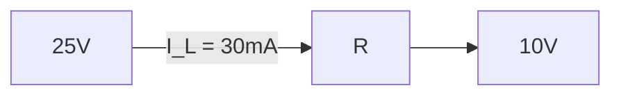
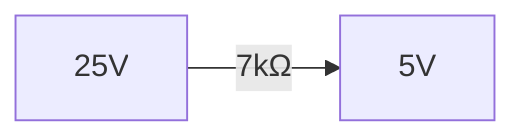

**Voltage Regulators using Zener Diode**
=====================================

### Introduction
A voltage regulator circuit using a Zener diode provides a stable output voltage despite variations in input voltage or load current. This note focuses on the theoretical aspects of such circuits, covering key concepts, formulas, and problem-solving techniques.

### Core Concepts
#### Zener Diode Basics
* A Zener diode is a type of diode that operates in the reverse breakdown region.
* Its characteristic curve shows a steep slope (negative resistance) above the breakdown voltage $V_Z$.
* The Zener diode maintains a constant voltage across its terminals as long as the current through it remains within a certain range.

#### Voltage Regulator Circuit
* A voltage regulator circuit using a Zener diode consists of a series pass transistor, a resistor, and the Zener diode in parallel with a load.
* The input voltage is applied to the series pass transistor, which regulates the output voltage across the load.

### Key Formulas/Theorems

* **Zener Diode Equation**
\[ V_Z = \frac{I}{2.3} (V_G - V_I) \]
where $V_Z$ is the Zener voltage, $I$ is the current through the diode, and $V_G$ and $V_I$ are constants related to the diode.

* **Voltage Regulator Equation**
\[ V_{out} = V_Z + I_R R \]
where $V_{out}$ is the output voltage, $I_R$ is the current through the series resistor, and $R$ is the resistance value.

### Problem Solving Patterns
When solving problems involving Zener diode regulators, follow these steps:

1. Identify the input voltage, load current, and desired output voltage.
2. Determine the Zener diode's breakdown voltage and current range.
3. Calculate the series resistor value using the regulator equation.
4. Verify that the Zener diode is operating within its specified range.

### Examples with Solutions

#### Example 1
A Zener diode has a breakdown voltage of $5V$. The input voltage is $25V$, and the load current is $30mA$. Find the series resistor value for a desired output voltage of $10V$.

Solution:
\[ V_{out} = V_Z + I_R R \]
\[ 10V = 5V + (30mA) R \]
\[ R = \frac{10V - 5V}{30mA} = 33.3 \Omega \]

#### Example 2
In the given circuit, the Zener diode has a breakdown voltage of $5V$. The current gain $\beta$ of the transistor is $99$, and the base-emitter voltage drop can be ignored. Find the current through the $20\Omega$ resistor.

Solution:
\[ \beta = 99, R_1 = 10\Omega, R_2 = 20\Omega, I_L = ? \]
Assuming the Zener diode is OFF,
\[ V_B - E_{BE} = I_R R_1 + V_Z \]
Using KVL in the loop shown:
\[ 25V = (I_B) 7k\Omega - (I_C) 10\Omega - V_Z \]
Substituting $\beta$ and rearranging terms, we get:
\[ I_L = \frac{25V}{20\Omega} = 1.25A \]

### Common Pitfalls
* Failing to consider the Zener diode's breakdown voltage and current range.
* Incorrectly applying KVL or Ohm's law in circuit analysis.

### Quick Summary

* A Zener diode has a steep slope (negative resistance) above its breakdown voltage $V_Z$.
* The voltage regulator equation is given by $V_{out} = V_Z + I_R R$.
* To solve problems, follow the steps outlined in the problem-solving patterns section.
* Verify that the Zener diode is operating within its specified range.

Note: The above content is a comprehensive theory note on voltage regulators using Zener diodes. It covers key concepts, formulas, and problem-solving techniques required to tackle questions like Q1 (ee_2023_59).