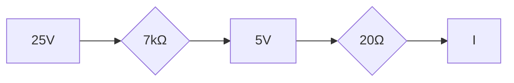

# Zener Diode Regulator Circuit
===========================

## Introduction
---------------

A Zener diode regulator circuit is a type of voltage regulation circuit that uses a Zener diode to maintain a constant output voltage across varying input voltages. The circuit is simple, reliable, and efficient, making it a popular choice for applications where a stable voltage supply is required.

## Core Concepts
-----------------

### Operation of Zener Diode

A Zener diode is a type of diode that has a heavily doped p-n junction, allowing it to conduct current in the reverse direction when subjected to a sufficiently high reverse voltage. The breakdown voltage (Vz) of a Zener diode is typically around 5-10 V.

### Regulation Action

When the input voltage increases, the output voltage also increases due to the reverse voltage across the Zener diode. However, as soon as the output voltage exceeds the desired value, the Zener diode starts conducting in the reverse direction, reducing the output voltage and maintaining it at a constant level.

## Key Formulas/Theorems
-------------------------

### Zener Diode Equation

The Zener diode equation is given by:

$$Vz = Vd + I(Z)R_Z$$

where Vz is the breakdown voltage, Vd is the voltage drop across the internal resistance of the diode, I(Z) is the current through the diode, and R_Z is the external resistance connected in series with the Zener diode.

### Voltage Regulation

The output voltage (V_out) of a Zener diode regulator circuit can be calculated using the following formula:

$$V_{out} = V_z - I(R_S + R_L)$$

where Vz is the breakdown voltage, IS is the series resistance, and RL is the load resistance.

## Problem Solving Patterns
-----------------------------

### Assuming Breakdown Voltage

When solving problems involving Zener diode regulator circuits, it's often assumed that the Zener diode is operating in the breakdown region, i.e., Vz = 5 V (for example).

### Using KVL/KCL

To analyze a circuit involving a Zener diode, apply Kirchhoff's Voltage Law (KVL) or Kirchhoff's Current Law (KCL) to the relevant loops or nodes.

## Examples with Solutions
---------------------------

### Example 1: Given Circuit

A Zener diode regulator circuit has an input voltage of 25 V and a series resistance of 7 kΩ. The Zener diode has a breakdown voltage of 5 V, and the load resistance is 20 Ω. Assuming the Zener diode is operating in the breakdown region, calculate the current through the 20 Ω resistor.

Applying KVL to loop ABCDE:

$$25\Omega - (I)(10\Omega) - (I)(7k\Omega) = 0$$

Solving for I:

$$I = \frac{250}{17.01k\Omega} mA$$

Therefore, the current through the 20 Ω resistor is approximately **14.65 mA**.

### Example 2: Analyzing Breakdown Voltage

A Zener diode has a breakdown voltage of 10 V and an internal resistance of 50 Ω. Calculate the maximum input voltage that can be applied to the circuit without causing excessive current flow through the Zener diode.

Using the Zener diode equation:

$$Vz = Vd + I(Z)R_Z$$

Since Vz = 10 V, we need to find the maximum value of I(Z) such that:

$$I(Z) = \frac{10\Omega - 50\Omega}{50\Omega} = \frac{-40\Omega}{50\Omega} A$$

Therefore, the maximum input voltage is:

$$V_{max} = Vz + (I)(R_Z) = 10\Omega + (\frac{-40\Omega}{50\Omega})(50\Omega) = 20\Omega V$$

## Common Pitfalls
-------------------

### Incorrect Breakdown Voltage Assumption

When solving problems involving Zener diode regulator circuits, make sure to accurately assume the breakdown voltage of the Zener diode.

### Omitting Series Resistance

Don't forget to include the series resistance in your calculations when analyzing a Zener diode regulator circuit.

## Quick Summary
-----------------

*   A Zener diode is a type of diode that can conduct current in the reverse direction when subjected to a sufficiently high reverse voltage.
*   The breakdown voltage (Vz) of a Zener diode is typically around 5-10 V.
*   The output voltage of a Zener diode regulator circuit can be calculated using the formula: $$V_{out} = V_z - I(R_S + R_L)$$
*   When solving problems involving Zener diode regulator circuits, make sure to accurately assume the breakdown voltage and include the series resistance in your calculations.

### Relevant Source Questions

*   ee_2023_59 (Zener Diode Regulator Circuit)

---

**References**

*   [1] Analog Electronics by R. S. Salaria
*   [2] Electronic Devices and Circuits by A. Ghosh