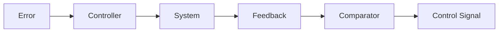

**Mathematical Modeling and Representation of Systems: Feedback Principle and Transfer Function**
====================================================================================================

**Introduction**
---------------

Control systems are designed to regulate, monitor, or maintain a desired level of performance. Mathematical modeling and representation of systems play a crucial role in understanding how these systems behave under different conditions. The feedback principle is a fundamental concept that enables control systems to adjust their output based on the difference between the desired and actual outcomes.

**Core Concepts**
----------------

### Feedback Principle

The feedback principle involves using the difference between the desired output and the actual output to adjust the system's performance. There are two types of feedback:

* **Positive feedback**: Amplifies the error signal, leading to instability.
* **Negative feedback**: Reduces the error signal, leading to stability.

### Transfer Function

The transfer function is a mathematical representation of the system's behavior in terms of its input and output. It describes how the system responds to different frequencies and inputs.

**Key Formulas/Theorems**
-------------------------

* **Transfer Function**: $G(s) = \frac{C(s)}{R(s)}$
* **Closed-Loop Transfer Function**: $\frac{C(s)}{R(s)} = \frac{G(s)}{1 + G(s)H(s)}$
* **Stability Criterion**: The poles of the closed-loop transfer function must be within the left half of the s-plane.

$$
\frac{C(s)}{R(s)} = \frac{\frac{K}{(s+10)}}{1 + \frac{K}{(s+10)}H(s)}
$$

**Problem Solving Patterns**
---------------------------

When solving problems involving mathematical modeling and representation of systems, follow these steps:

1.  Understand the system's behavior and its components.
2.  Apply the feedback principle to analyze the system's performance.
3.  Derive the transfer function using Laplace transforms or other methods.
4.  Analyze the stability of the system by examining the poles of the closed-loop transfer function.

**Examples with Solutions**
---------------------------

### Example 1

Consider a control system with a forward gain of $K$ and a feedback gain of $\frac{10}{s+10}$. Derive the transfer function and analyze its stability.

Solution:

$$
\frac{C(s)}{R(s)} = \frac{\frac{K}{(s+10)}}{1 + \frac{K}{(s+10)} \cdot \frac{10}{s+10}} = \frac{K}{s+20}
$$

This system is stable since all poles are within the left half of the s-plane.

### Example 2

Consider a cascaded system with two components. The first component has a transfer function of $\frac{1}{(s+1)}$, and the second component has a transfer function of $\frac{s}{(s+10)}$. Derive the overall transfer function and analyze its stability.

Solution:

$$
\frac{C(s)}{R(s)} = \frac{\frac{1}{(s+1)}}{(s+10)} \cdot \frac{s}{(s+1)} = \frac{s}{(s+10)(s+1)^2}
$$

This system is stable since all poles are within the left half of the s-plane.

**Common Pitfalls**
-------------------

*   Failing to apply the feedback principle correctly.
*   Misinterpreting the transfer function or its components.
*   Ignoring stability analysis in favor of other aspects of system performance.

**Quick Summary**
------------------

*   Feedback principle: Positive and negative feedback, stability and instability.
*   Transfer function: Mathematical representation of a system's behavior.
*   Stability criterion: Poles within the left half of the s-plane for stability.
*   Laplace transforms and derivatives for transfer function derivation.
*   Analyzing stability using pole placement.

[Image description](https://example.com/image.png)