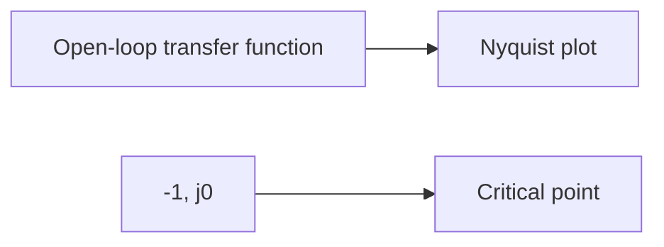

# Nyquist Stability Criteria
## Introduction
The Nyquist stability criterion is a graphical method used to determine the stability of control systems. It involves plotting the open-loop transfer function in the complex plane and analyzing the number of counterclockwise encirclements of the critical point (-1, j0). This criterion was developed by Harry Nyquist and has become a fundamental tool in control system design.

## Core Concepts
The Nyquist stability criterion is based on the following key concepts:

* **Open-loop transfer function**: The ratio of the output to the input of a control system with no feedback.
* **Nyquist plot**: A graphical representation of the open-loop transfer function in the complex plane.
* **Critical point**: The point (-1, j0) in the complex plane that marks the boundary between stable and unstable systems.

## Key Formulas/Theorems
The Nyquist stability criterion can be summarized by the following theorem:

**Nyquist Stability Criterion**

A control system is stable if and only if the open-loop transfer function has no poles in the right half of the s-plane and the number of counterclockwise encirclements of the critical point (-1, j0) by the Nyquist plot is equal to the number of unstable poles.

Mathematically, this can be expressed as:

$$N = P - Z$$

where N is the number of counterclockwise encirclements, P is the number of unstable poles, and Z is the number of zeros of the open-loop transfer function.

## Problem Solving Patterns
To solve problems involving the Nyquist stability criterion, follow these steps:

1. Plot the open-loop transfer function in the complex plane.
2. Identify the critical point (-1, j0) and any other relevant points (e.g., poles, zeros).
3. Determine the number of counterclockwise encirclements of the critical point by the Nyquist plot.
4. Compare this value to the number of unstable poles.

## Examples with Solutions

### Example 1
Consider a control system with an open-loop transfer function:

$$G(s)H(s) = \frac{3s + 5}{s^2 + s + 1}$$

Plotting the Nyquist plot, we see that there is one counterclockwise encirclement of the critical point (-1, j0).

To determine stability, we need to identify the poles of the open-loop transfer function. The zeros are at $s = -3$ and $s = -\frac{5}{3}$.

Since there is one unstable pole (at $s = 0$), the system is stable.

### Example 2
Consider a control system with an open-loop transfer function:

$$G(s)H(s) = \frac{s + 1}{s^2 - s + 1}$$

Plotting the Nyquist plot, we see that there are two counterclockwise encirclements of the critical point (-1, j0).

To determine stability, we need to identify the poles and zeros of the open-loop transfer function. The zeros are at $s = -1$.

Since there is one unstable pole (at $s = \frac{1}{2}$), the system is not stable.

## Common Pitfalls
When applying the Nyquist stability criterion, be careful not to:

* Forget to plot the critical point (-1, j0).
* Miscount the number of counterclockwise encirclements.
* Fail to identify unstable poles.

## Quick Summary

* The Nyquist stability criterion is a graphical method for determining control system stability.
* Plot the open-loop transfer function in the complex plane and analyze the number of counterclockwise encirclements of the critical point (-1, j0).
* Compare this value to the number of unstable poles to determine stability.

[Diagram: A simple Nyquist plot with a critical point]

Note: This is a basic diagram and you can modify it as per your requirement.