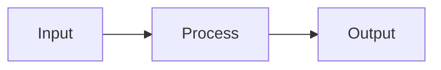
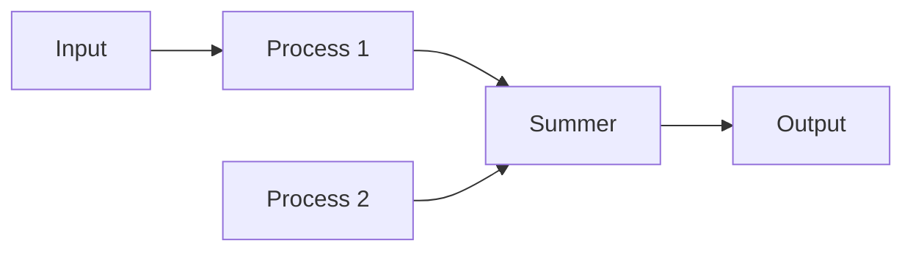

**Transfer Function**
=====================

**Introduction**
---------------

The transfer function is a fundamental concept in control systems, representing the relationship between the input and output of a system. It is a mathematical representation of the system's behavior, used to analyze and design controllers.

**Core Concepts**
-----------------

### Definition

The transfer function of a system is defined as the ratio of the Laplace transform of the output to the Laplace transform of the input.

$$H(s) = \frac{Y(s)}{X(s)}$$

where $Y(s)$ is the Laplace transform of the output and $X(s)$ is the Laplace transform of the input.

### Types of Transfer Functions

There are two main types of transfer functions:

* **Stable transfer function**: The system's poles lie in the left half of the s-plane.
* **Unstable transfer function**: The system's poles lie in the right half of the s-plane or on the imaginary axis.

**Key Formulas/Theorems**
-------------------------

### Laplace Transform

The Laplace transform is a fundamental tool for analyzing transfer functions. It is defined as:

$$F(s) = \int_{0}^{\infty} f(t)e^{-st}dt$$

where $f(t)$ is the time-domain function and $s$ is the complex frequency variable.

### Transfer Function Block Diagram Algebra

Given a block diagram, we can derive the transfer function using block diagram algebra. The rules for combining blocks are:

* **Series connection**: $H(s) = H_1(s) \cdot H_2(s)$
* **Parallel connection**: $\frac{1}{H(s)} = \frac{1}{H_1(s)} + \frac{1}{H_2(s)}$
* **Feedback loop**: $H(s) = \frac{H_1(s)}{1 - H_2(s)}$

### Examples

Let's consider an example of a simple block diagram:

The transfer function for this system is given by:

$$H(s) = \frac{Y(s)}{X(s)} = \frac{G(s)}{1 + G(s)}$$

where $G(s)$ is the transfer function of the process.

**Problem Solving Patterns**
---------------------------

* **Simplify block diagrams**: Look for opportunities to simplify complex block diagrams by combining blocks or removing unnecessary ones.
* **Apply transfer function rules**: Use the rules for series, parallel, and feedback connections to derive the overall transfer function.
* **Analyze stability**: Check if the system's poles lie in the left half of the s-plane.

**Examples with Solutions**
---------------------------

### Example 1

Given the block diagram:

Derive the transfer function for this system.

**Solution**

Using block diagram algebra, we can derive the transfer function as follows:

$$H(s) = \frac{Y(s)}{X(s)} = \frac{G_1(s) + G_2(s)}{1 + G_1(s)G_2(s)}$$

where $G_1(s)$ and $G_2(s)$ are the transfer functions of Process 1 and Process 2, respectively.

### Example 2

Given the transfer function:

$$H(s) = \frac{Y(s)}{X(s)} = \frac{s + 2}{s^2 + 3s + 2}$$

Determine if this system is stable.

**Solution**

The poles of the system are given by:

$$\text{Poles} = s = -1, -2$$

Since both poles lie in the left half of the s-plane, the system is stable.

**Common Pitfalls**
------------------

* **Incorrect application of block diagram algebra**: Make sure to apply the rules for series, parallel, and feedback connections correctly.
* **Insufficient analysis of stability**: Always check if the system's poles lie in the left half of the s-plane.

**Quick Summary**
-----------------

* Transfer function represents the relationship between input and output
* Laplace transform is a fundamental tool for analyzing transfer functions
* Block diagram algebra rules: series, parallel, and feedback connections
* Stability analysis: check if poles lie in the left half of the s-plane