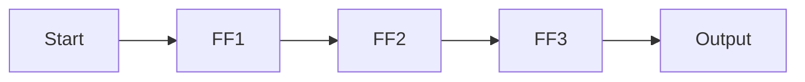
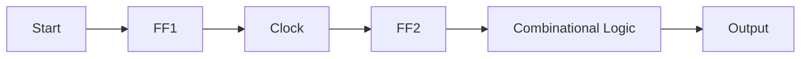

# Counters and Sequential Circuits
## Introduction

Counters are sequential circuits that count the number of clock pulses applied to them. They are a fundamental building block in digital electronics and are used in various applications, including counters, timers, and memory devices. In this note, we will cover the basic principles of counters and sequential circuits.

## Core Concepts

### What is a Counter?

A counter is a type of sequential circuit that counts the number of clock pulses applied to it. It can be thought of as a digital thermometer that measures the temperature in terms of the number of clock pulses.

### Types of Counters

There are two main types of counters:

* **Asynchronous Counters**: These counters count asynchronously, meaning they do not require a clock signal to operate.
* **Synchronous Counters**: These counters count synchronously, meaning they require a clock signal to operate.

### Flip-Flops in Counters

Flip-flops are the basic building blocks of counters. They store one bit of information and can be used to count up or down. There are two main types of flip-flops:

* **JK Flip-Flop**: This flip-flop can be used as a toggle flip-flop, meaning it toggles its output on each clock pulse.
* **D Flip-Flop**: This flip-flop can be used as a storage element, meaning it stores the input data on each clock pulse.

## Key Formulas/Theorems

### Clock Period (T)

The clock period is the time interval between two consecutive clock pulses. It is given by:

$$T = \frac{1}{f}$$

where $f$ is the frequency of the clock signal.

### Propagation Delay (tp)

The propagation delay is the time it takes for a flip-flop to change its output after receiving a clock pulse. It is given by:

$$tp = \frac{\tau}{n}$$

where $\tau$ is the mean time between failures and $n$ is the number of stages in the counter.

### Maximum Clock Frequency (f_max)

The maximum clock frequency is the highest frequency at which a counter can operate without failing. It is given by:

$$f_{max} = \frac{1}{2tp}$$

where $tp$ is the propagation delay.

## Problem Solving Patterns

### 1. Counting Up/Down

To count up/down, we need to connect the output of each flip-flop to the input of the next flip-flop in a chain. This creates a ripple effect where each flip-flop changes its output after receiving a clock pulse.

### 2. Synchronous Counters

To create a synchronous counter, we need to connect each flip-flop to the clock signal and use a combinational logic circuit to count up/down.

## Examples with Solutions

### Example 1: 4-Stage Ripple Counter

Given a 4-stage ripple counter with each flip-flop having a propagation delay of 20 ns, find the maximum clock frequency in MHz.

Solution:

$$tp = \frac{\tau}{n} = \frac{20ns}{4} = 5ns$$

$$f_{max} = \frac{1}{2tp} = \frac{1}{2 \times 5ns} = 100MHz$$

### Example 2: Synchronous Counter

Given a synchronous counter with each flip-flop connected to the clock signal and a combinational logic circuit, find the maximum clock frequency in MHz.

Solution:

$$f_{max} = \frac{1}{tp} = \frac{1}{5ns} = 200MHz$$

## Common Pitfalls

* Forgetting to connect each flip-flop to the clock signal in synchronous counters.
* Not accounting for propagation delay when calculating maximum clock frequency.
* Confusing asynchronous and synchronous counters.

## Quick Summary

| Topic | Key Concepts |
| --- | --- |
| Counters | Asynchronous, Synchronous, Flip-Flops, Clock Period (T), Propagation Delay (tp) |
| Sequential Circuits | Flip-Flops, JK Flip-Flop, D Flip-Flop, Combinational Logic |

I hope this comprehensive theory note helps you master the concepts of counters and sequential circuits!