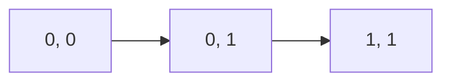

**K-Map Theory Note**
=======================

### Introduction

A K-Map (Karnaugh Map) is a systematic method for simplifying Boolean functions, particularly those with multiple variables. It's an essential tool in digital electronics for reducing complexity and improving efficiency.

### Core Concepts

#### What is a K-Map?

A K-Map is a rectangular grid where each cell represents a unique combination of variable values (0 or 1). The goal is to identify clusters of adjacent cells that satisfy the Boolean function, thus simplifying it.

**Types of Variables**

*   **Complemented Variables**: Represented by an overbar (e.g., $\overline{A}$)
*   **Uncomplemented Variables**: No overbar

#### K-Map Laws and Theorems

1.  **Theorem:** A Boolean function can be simplified using a K-Map if it has any adjacent clusters.
2.  **Law:** Adjacent cells with identical variable values can be combined.

**Example K-Map:**

In this example:

*   A represents the combination $A \land \overline{B}$
*   B represents the combination $A \lor \overline{B}$
*   C represents the combination $\overline{A} \lor B$

### Key Formulas/Theorems

#### K-Map Simplification Rules:

1.  **Grouping Rule**: Identify adjacent cells with identical variable values and group them.
2.  **Complementation Law**: Complement a cell by changing its contents (e.g., 0 to 1 or 1 to 0).

### Problem Solving Patterns

**Step-by-Step K-Map Simplification:**

1.  List all minterms of the Boolean function
2.  Create a K-Map with rows and columns representing variable values
3.  Mark each cell in the K-Map according to its corresponding minterm value (0 or 1)
4.  Identify clusters of adjacent cells with identical variable values
5.  Simplify the function using the identified clusters

### Examples with Solutions

**Example 1:**

Suppose we have a Boolean function $F(A, B) = \overline{A} \lor B$. We can represent it as:

| A | $\overline{A}$ |
| --- | --- |
| 0 | 1 |
| 1 | 0 |

We can simplify this K-Map by grouping the adjacent cells with identical variable values, resulting in a simplified function $F(A, B) = \overline{B} \lor A$.

**Example 2:**

Consider another Boolean function $G(C, D) = C \land \overline{D}$. We can represent it as:

| C | $\overline{C}$ |
| --- | --- |
| 0 | 1 |
| 1 | 0 |

We can simplify this K-Map by applying the Complementation Law to obtain a simplified function $G(C, D) = \overline{\overline{D}} \land C$.

### Common Pitfalls

*   Failing to identify all clusters of adjacent cells
*   Misapplying the Simplification Rules
*   Not using K-Map simplification for Boolean functions with multiple variables