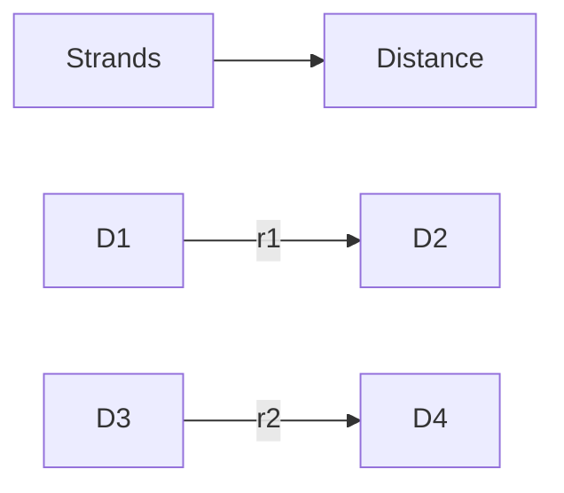

**Conductors and Overhead Lines**
==============================

**Introduction**
---------------

Overhead lines (OHL) are a crucial component of power transmission systems, responsible for transporting electrical energy over long distances with minimal loss. Understanding the characteristics and behavior of conductors is essential for designing efficient and safe OHL.

**Core Concepts**
-----------------

### Geometric Mean Radius (GMR)

The GMR is an important parameter in overhead line design, representing the equivalent radius of a conductor considering its multiple strands. It's defined as:

$$ \text{GMR} = r^{(1/4)} \quad \text{where } r\text{'s are the distances between strands} $$

In the case of four equal strands with each strand having a radius `r`, we calculate GMR by multiplying all the distances, including self-distance.



For four strands with a radius `r` each:

$$ \text{GMR} = r^{(0.7788)} $$

### Sequence Impedance

Sequence impedance is a critical parameter in power systems, describing the impedance of a line for different sequence types (positive, negative, and zero). For a fully transposed three-phase transmission line, we can calculate the sequence impedances using:

$$ Z_{11} = R + j\omega L $$

$$ Z_{22} = \frac{1}{3}Z_{11} $$

$$ Z_{03} = 2Z_{11} - Z_{12} $$

where `R` is the resistance, `L` is the inductance, and `ω` is the angular frequency.

### Transposed Lines

Transposed lines are designed to minimize sequence impedances by arranging conductors in a specific pattern. This reduces the risk of resonance and ensures stable operation.

**Key Formulas/Theorems**
-------------------------

*   Geometric Mean Radius (GMR): $$ \text{GMR} = r^{(1/4)} $$
*   Sequence Impedance: $$ Z_{11} = R + j\omega L $$

    $$ Z_{22} = \frac{1}{3}Z_{11} $$

    $$ Z_{03} = 2Z_{11} - Z_{12} $$

**Problem Solving Patterns**
---------------------------

*   When dealing with GMR, consider all distances between strands and self-distance.
*   For sequence impedance calculations, use the formulas above and apply them to the specific line configuration.

**Examples with Solutions**
-------------------------

### Example 1: Geometric Mean Radius

Given four equal strands with each strand having a radius `r`, calculate the geometric mean radius (GMR).

```markdown
# GMR Calculation
## Given values:
- Number of strands: 4
- Strand radius: r

## Solution:
GMR = r^(0.7788)
```

### Example 2: Sequence Impedance

For a fully transposed three-phase transmission line, calculate the sequence impedances using:

$$ Z_{11} = R + j\omega L $$

$$ Z_{22} = \frac{1}{3}Z_{11} $$

$$ Z_{03} = 2Z_{11} - Z_{12} $$

```markdown
# Sequence Impedance Calculation
## Given values:
- Resistance: R
- Inductance: L
- Angular frequency: ω

## Solution:
Z11 = R + jωL
Z22 = (1/3) * Z11
Z03 = 2*Z11 - Z12
```

**Common Pitfalls**
-------------------

*   Failing to consider self-distance when calculating GMR.
*   Incorrectly applying sequence impedance formulas.

**Quick Summary**
------------------

*   Geometric Mean Radius (GMR): $$ \text{GMR} = r^{(1/4)} $$
*   Sequence Impedance: Use the formulas above for specific line configurations.
*   Consider all distances between strands and self-distance when calculating GMR.