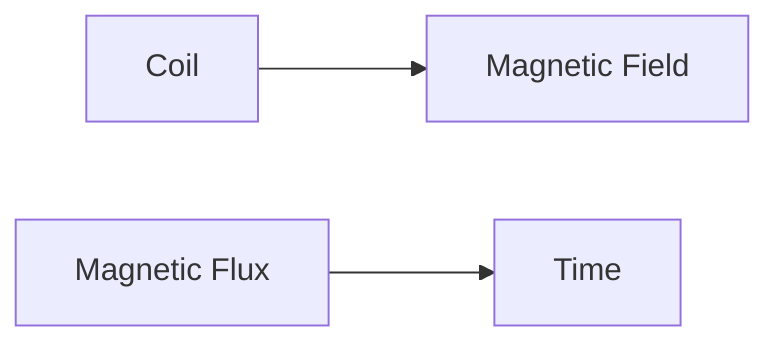
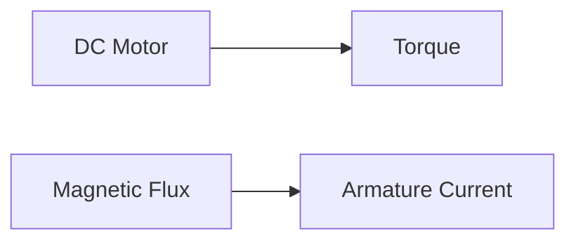

# DC Machine
================

## Introduction

A DC machine, also known as a direct current machine, is an electrical machine that converts mechanical energy into electrical energy or vice versa. It consists of two main parts: the stator and the rotor. The stator carries the magnetic field, while the rotor rotates within this field to produce the desired effect.

## Core Concepts

### 1. Construction of a DC Machine

A DC machine has the following components:

*   Stator: A stationary part that carries the magnetic field.
*   Rotor: A rotating part that interacts with the magnetic field to produce the desired effect.
*   Armature: A coil or set of coils on the rotor that carries the current.
*   Commutator: A device that reverses the direction of current flow in the armature.

### 2. Types of DC Machines

There are two main types of DC machines:

*   DC Generator (DCG): Converts mechanical energy into electrical energy.
*   DC Motor (DCM): Converts electrical energy into mechanical energy.

## Key Formulas/Theorems

### 1. EMF Induced in a Coil

The EMF induced in a coil is given by Faraday's law of induction:

$$\mathcal{E} = -N \frac{\mathrm{d}\Phi}{\mathrm{d}t}$$

where $N$ is the number of turns, $\Phi$ is the magnetic flux, and $t$ is time.

### 2. Torque in a DC Motor

The torque developed in a DC motor is given by:

$$T = k_i I_a \phi_m$$

where $k_i$ is the armature constant, $I_a$ is the armature current, and $\phi_m$ is the magnetic flux.

### 3. Efficiency of a DC Machine

The efficiency of a DC machine is defined as the ratio of output power to input power:

$$\eta = \frac{P_{out}}{P_{in}}$$

where $P_{out}$ is the output power and $P_{in}$ is the input power.

## Problem Solving Patterns

### 1. Identifying the Type of DC Machine

To solve problems involving DC machines, it's essential to identify whether the machine is a generator or motor.

*   If the machine converts mechanical energy into electrical energy, it's a DC generator.
*   If the machine converts electrical energy into mechanical energy, it's a DC motor.

### 2. Calculating EMF and Torque

To calculate EMF and torque in a DC machine, use the formulas mentioned earlier:

*   For EMF: $\mathcal{E} = -N \frac{\mathrm{d}\Phi}{\mathrm{d}t}$
*   For torque: $T = k_i I_a \phi_m$

### 3. Analyzing Efficiency

To analyze efficiency in a DC machine, use the formula:

$$\eta = \frac{P_{out}}{P_{in}}$$

## Examples with Solutions

### Example 1: EMF Induced in a Coil

A coil of 100 turns is placed within a magnetic field. The magnetic flux increases from 2 Wb to 4 Wb in 5 seconds. Calculate the induced EMF.

Solution:

Using Faraday's law of induction:

$$\mathcal{E} = -N \frac{\mathrm{d}\Phi}{\mathrm{d}t}$$

$$\mathcal{E} = -100 \left(\frac{4-2}{5}\right)$$

$$\mathcal{E} = 8 V$$

### Example 2: Torque in a DC Motor

A DC motor has an armature constant of 0.1 Nm/A and develops a torque of 10 Nm when the armature current is 50 A and magnetic flux is 100 mWb. Calculate the efficiency.

Solution:

Using the torque formula:

$$T = k_i I_a \phi_m$$

$$10 = 0.1 \times 50 \times 100 \times 10^{-3}$$

The efficiency can be calculated using the power output and input:

$$\eta = \frac{P_{out}}{P_{in}}$$

## Common Pitfalls

*   Confusing DC generators with motors.
*   Not considering magnetic flux while calculating EMF and torque.
*   Ignoring armature current while analyzing efficiency.

## Quick Summary

*   Types of DC machines: DCG and DCM
*   Key formulas: Faraday's law, torque in a DC motor, and efficiency
*   Problem solving patterns: Identifying machine type, calculating EMF and torque, and analyzing efficiency.