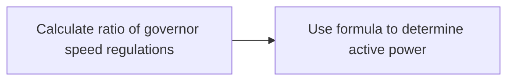

**Synchronous Machines Performance Characteristics**
=====================================================

**Introduction**
---------------

Synchronous machines are crucial components in power generation and transmission systems. Understanding their performance characteristics is essential for efficient operation, stability, and control of these systems. This note covers the key concepts, formulas, and problem-solving techniques related to synchronous machine performance.

**Core Concepts**
-----------------

### Synchronous Machine Operation

A synchronous machine operates by converting mechanical energy into electrical energy or vice versa. It consists of a stator (stationary part) with windings and a rotor (rotating part). The rotor is connected to a prime mover, which provides the mechanical input. In generating mode, the rotor spins due to the mechanical input, inducing an electromotive force (EMF) in the stator windings.

### Governor Speed Regulation

Governor speed regulation is a measure of how much the speed of a synchronous machine can change from no-load to full-load conditions. It is typically expressed as a percentage and represents the range of speed variation allowed by the governor.

**Key Formulas/Theorems**
-------------------------

### Active Power Sharing between Parallel Generators

For two generators operating in parallel, the active power shared by each generator can be calculated using the following formula:

$$ P_1 = \frac{P_{total}}{\left( \frac{N_1}{N_2} \right)^2} $$

where $P_1$ is the active power shared by the first generator, $P_{total}$ is the total load, and $\frac{N_1}{N_2}$ is the ratio of governor speed regulations.

### Example: Load Sharing between Two Generators

Suppose we have two generators with ratings 250 MW and 400 MW, respectively. Their governor speed regulations are 6% and 6.4%, respectively. Both generators are operating in parallel to share a load of 500 MW.

Using the formula above:

$$ P_1 = \frac{500}{\left( \frac{0.06}{0.064} \right)^2} $$

Solving for $P_1$ gives us the active power shared by the first generator.

**Problem Solving Patterns**
---------------------------

### Free Governor Action

When two generators are operating in parallel under free governor action, their speeds adjust to share the load according to their respective ratings and speed regulations. This means that the faster governor will take up more load until the slower one reaches its maximum capacity.

To solve problems involving free governor action:

1. Calculate the ratio of governor speed regulations.
2. Use the formula above to determine the active power shared by each generator.

**Examples with Solutions**
-------------------------

### Example 1: Load Sharing

Given:

* Two generators with ratings 250 MW and 400 MW, respectively
* Governor speed regulations 6% and 6.4%, respectively
* Total load of 500 MW

Calculate the active power shared by the first generator.

**Common Pitfalls**
-------------------

### Incorrect Ratio Calculation

When calculating the ratio of governor speed regulations, ensure you are comparing the actual regulation values and not their percentages. For example:

$$ \frac{0.06}{0.064} = 0.9375 $$

Not:

$$ \frac{6\%}{6.4\%} = \frac{0.06}{0.064} = 1 $$

**Quick Summary**
-----------------

* Synchronous machine operation and governor speed regulation
* Active power sharing between parallel generators using the formula: $P_1 = \frac{P_{total}}{\left( \frac{N_1}{N_2} \right)^2}$
* Free governor action and load sharing

Note that this is just a starting point, and you should expand on these concepts to ensure comprehensive coverage of the topic.