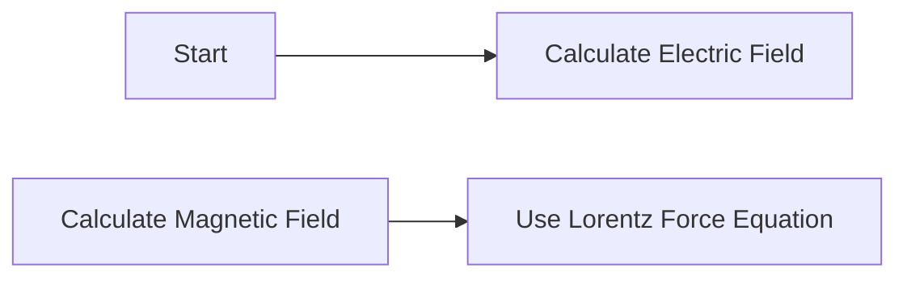

**Electrostatics and Electromagnetic Field**
=============================================

### Introduction
---------------

Electrostatics deals with the study of electric charges at rest, while electromagnetic fields describe the interaction between electric and magnetic forces. This topic is crucial in understanding various phenomena such as electric circuits, motors, generators, and high-voltage engineering.

### Core Concepts
-----------------

*   **Electric Field** ($\mathbf{E}$): a vector field that describes the force per unit charge at every point in space.
*   **Magnetic Field** ($\mathbf{B}$): a vector field that describes the force experienced by a moving charge or current-carrying wire.
*   **Gauss's Law**: $\oint_{S} \mathbf{E} \cdot d\mathbf{A} = Q_{enc}$, where $Q_{enc}$ is the enclosed electric charge and $S$ is the surface enclosing it.
*   **Lorentz Force**: $\mathbf{F} = q(\mathbf{E} + \mathbf{v} \times \mathbf{B})$, where $q$ is the charge, $\mathbf{v}$ is its velocity, and $\mathbf{B}$ is the magnetic field.

### Key Formulas/Theorems
-------------------------

*   **Electric Field Intensity**: $E = k\frac{Q}{r^2}$
*   **Magnetic Field Intensity**: $B = \mu_0I$, where $I$ is the current and $\mu_0$ is the permeability of free space.
*   **Amperes Law**: $\oint_{C} \mathbf{B} \cdot d\mathbf{l} = \mu_0 I_{enc}$, where $I_{enc}$ is the enclosed current.

```latex
$$E = k\frac{Q}{r^2}$$
```

### Problem Solving Patterns
---------------------------

*   **Line Integral**: calculate the work done by a force field along a curve.
*   **Surface Integral**: calculate the flux of an electric field through a surface.
*   **Path Independence**: use Stokes' Theorem to relate line integrals and surface integrals.



### Examples with Solutions
---------------------------

Q1: A point charge $+q$ is placed at the origin. Find the electric field strength at a distance $r$ from the charge.

A:
```latex
E = k\frac{q}{r^2}
```
Using $k = 9 \times 10^9 N m^2 C^{-2}$, calculate the value of $E$ for $q = 1.6 \times 10^{-19} C$ and $r = 0.5 m$.

Solution:
```latex
E = k\frac{q}{r^2}
= (9 \times 10^9) \frac{1.6 \times 10^{-19}}{(0.5)^2}
= 3.366 \times 10^8 N/C
```

### Common Pitfalls
------------------

*   Misinterpretation of sign conventions for electric and magnetic fields.
*   Incorrect application of Gauss's Law or Ampere's Law.

### Quick Summary
---------------

*   Electric Field: describes force per unit charge at every point in space.
*   Magnetic Field: describes force experienced by moving charges or current-carrying wires.
*   Key Formulas/Theorems:
	+ Electric Field Intensity ($E = k\frac{Q}{r^2}$)
	+ Magnetic Field Intensity ($B = \mu_0 I$)
	+ Amperes Law ($\oint_{C} \mathbf{B} \cdot d\mathbf{l} = \mu_0 I_{enc}$)

Please note that the above content is a starting point, and you can further expand or modify it according to your specific needs.