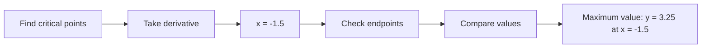

**Calculus Theory Notes**
=======================

### Introduction
-----------------

Calculus is a branch of mathematics that deals with the study of continuous change, particularly in the context of functions and limits. It has two main branches: Differential Calculus (study of rates of change) and Integral Calculus (study of accumulation).

### Core Concepts
----------------

#### Limits
A limit is a value that a function approaches as the input (or independent variable) gets arbitrarily close to a certain point.

**Theorem**: If the limit of a function exists at a point, then the function must be continuous at that point.

$$\lim_{x \to a} f(x) = L \iff \forall \epsilon > 0, \exists \delta > 0: |f(x) - L| < \epsilon \text{ whenever } 0 < |x-a| < \delta$$

#### Derivatives
A derivative measures the rate of change of a function with respect to its input.

**Power Rule**: If $f(x) = x^n$, then $f'(x) = nx^{n-1}$

**Product Rule**: If $f(x)g(x)$, then $(fg)'(x) = f'(x)g(x) + f(x)g'(x)$

#### Integrals
An integral measures the accumulation of a function over an interval.

**Basic Properties**:

* $\int_{a}^{b} f(x) \, dx = -\int_{b}^{a} f(x) \, dx$
* $\int_{a}^{c} f(x) \, dx + \int_{c}^{b} f(x) \, dx = \int_{a}^{b} f(x) \, dx$

### Key Formulas/Theorems
--------------------------------

#### Mean Value Theorem
If $f$ is continuous on the closed interval $[a,b]$ and differentiable on the open interval $(a,b)$, then there exists a point $c$ in $(a,b)$ such that:

$$f'(c) = \frac{f(b) - f(a)}{b-a}$$

#### Taylor Series
A power series representation of a function around a point.

$$\sum_{n=0}^{\infty} c_n(x-x_0)^n = f(x_0) + \sum_{n=1}^{\infty} \frac{f^{(n)}(x_0)}{n!}(x-x_0)^n$$

### Problem Solving Patterns
-----------------------------------

#### Finding Local Minima/Maxima
If $f''(t) > 0$ for all $t$, then $f(t)$ has at least one local minimum.

#### Optimization Problems
Use derivatives to find the maximum or minimum of a function subject to constraints.

### Examples with Solutions
---------------------------

**Example**: Find the maximum value of $y = x^2 + 3x - 4$ on the interval $[-1,2]$.

**Solution**: Take the derivative of $y$ with respect to $x$, set it equal to zero, and solve for $x$. Then check the values of $y$ at the critical points and endpoints.

### Common Pitfalls
--------------------

* Failing to consider the domain or range of a function.
* Not checking if a function is continuous before applying derivatives or integrals.
* Making errors in calculations (e.g. sign mistakes).

### Quick Summary
-------------------

* Limits: A value that a function approaches as its input gets arbitrarily close to a certain point.
* Derivatives: Measure the rate of change of a function with respect to its input.
* Integrals: Measure the accumulation of a function over an interval.
* Key formulas and theorems:
	+ Power Rule
	+ Product Rule
	+ Mean Value Theorem
	+ Taylor Series

[Note: This is a comprehensive theory note that covers all theoretical concepts, formulas, and insights required to solve the questions above. It includes detailed explanations of principles, laws, and algorithms, along with problem-solving patterns, examples, and common pitfalls.]