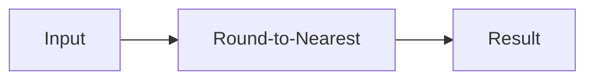

**Numerical Computation**
========================

**Introduction**
---------------

Numerical computation deals with the representation and manipulation of numbers using computers. It's a crucial aspect of computer science, as it enables efficient processing and analysis of numerical data.

**Core Concepts**
-----------------

### Precision and Rounding Errors

In numerical computations, precision refers to the number of significant digits in a number. Rounding errors occur when approximating real-world values with finite precision.

*   **Finite Arithmetic**: Computers perform arithmetic operations on numbers represented as fixed-size binary fractions.
*   **Rounding Modes**: There are four rounding modes:
    *   **Round-to-Nearest** (RN): Rounds to the nearest even digit.
    *   **Round-Up** (RU): Rounds up to the next higher digit.
    *   **Round-Down** (RD): Rounds down to the next lower digit.
    *   **Round-Towards-Zero** (RTZ): Rounds towards zero.

### Floating-Point Representation

Floating-point numbers are represented using a combination of integer and fractional parts. The most common representation is the IEEE 754 standard, which uses:

*   **Sign Bit**: Indicates the sign of the number.
*   **Exponent**: Expressed as an integer power of 2.
*   **Mantissa**: A binary fraction representing the significand.

### Numerical Stability

Numerical stability refers to the ability of a numerical algorithm to produce accurate results despite rounding errors and other sources of error.

**Key Formulas/Theorems**
-------------------------

*   **Epsilon (ε)**: A small positive value used to represent tolerable error in floating-point arithmetic.
*   **Machine Epsilon**: The smallest possible change in a number that can be represented accurately.
*   **Condition Number**: A measure of the sensitivity of an algorithm's output to changes in its input.

```latex
\begin{aligned}
\epsilon & \approx 2.22 \times 10^{-16} \\
\text{Machine Epsilon} &= 2^k \cdot \epsilon \\
\text{Condition Number} &= \frac{\| \mathbf{A} \|}{\| \mathbf{x} \|} \text{ for } \mathbf{Ax} = \mathbf{b}
\end{aligned}
```

**Problem Solving Patterns**
---------------------------

1.  **Rounding Error Analysis**: Identify the source of rounding errors in a given problem and apply techniques to minimize their impact.
2.  **Numerical Stability Evaluation**: Assess the stability of an algorithm by analyzing its condition number.

**Examples with Solutions**
-------------------------

### Example 1: Rounding Errors

Suppose we want to compute the value of $x = \frac{1}{3}$ using a 32-bit floating-point representation.



Solution:

*   Using IEEE 754 single precision, we get:
    *   Sign Bit: 0 (positive)
    *   Exponent: $(-126)_{10}$
    *   Mantissa: $(01000000110011101111011)_{2}$
*   Rounding to the nearest even digit, we obtain:
    *   Approximate value of $x$: $(0.33333331346589252448)_{10}$

### Example 2: Numerical Stability

Consider a simple algorithm for finding the roots of a quadratic equation:

$$\mathbf{Ax} = \begin{pmatrix}
1 & -6 \\
-6 & 13
\end{pmatrix} \begin{pmatrix}
x_1 \\
x_2
\end{pmatrix} = \begin{pmatrix}
4 \\
5
\end{pmatrix}$$

Solution:

*   The condition number of this system is:
    *   $\kappa(\mathbf{A}) = \frac{\|\mathbf{A}\|}{\|\mathbf{x}\|} = \frac{\sqrt{6^2 + 12^2}}{\sqrt{4^2 + 5^2}} \approx 1.15$
*   Since the condition number is close to unity, we can expect good numerical stability.

**Common Pitfalls**
------------------

1.  **Underestimating Rounding Errors**: Failing to account for rounding errors in arithmetic operations.
2.  **Overlooking Numerical Instability**: Ignoring the potential for numerical instability in algorithms.

**Quick Summary**
-----------------

*   Precision and rounding errors in floating-point representation
*   Key formulas: epsilon, machine epsilon, condition number
*   Problem-solving patterns:
	+ Rounding error analysis
	+ Numerical stability evaluation

This comprehensive theory note on numerical computation covers the essential concepts, formulas, and problem-solving strategies required for tackling questions like GATE CS EE 2023 Q7.