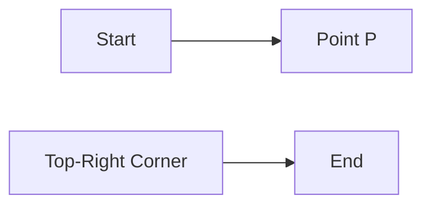
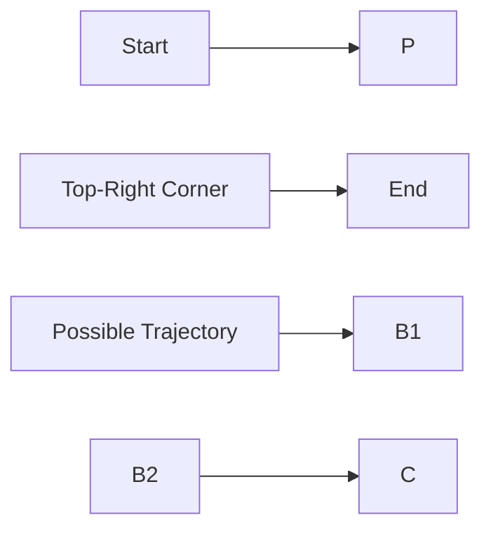
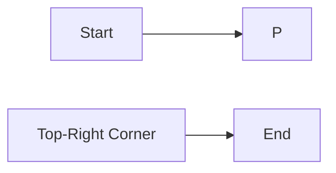

**Spatial Aptitude**
======================

**Introduction**
---------------

Spatial aptitude is a crucial aspect of problem-solving, especially in fields like Computer Science and Engineering. It involves understanding and visualizing spatial relationships between objects, which is essential for tasks such as reasoning about algorithms, data structures, and computational complexity.

**Core Concepts**
-----------------

### Grid Movement

The concept of grid movement is central to the spatial aptitude questions. A grid is a two-dimensional array of points, where each point has a unique set of coordinates (x, y). The ant's movement is restricted to the lines marked in the grid, and it aims to move to the top-right corner while decreasing its distance to that corner.

### Trajectory

A trajectory refers to the path followed by the ant as it moves through the grid. In this context, a valid trajectory must decrease the current distance to the top-right corner at each step.

**Key Formulas/Theorems**
-------------------------

No specific formulas or theorems are directly applicable to this topic. However, understanding of basic geometry and spatial reasoning is essential for solving these types of problems.

**Problem Solving Patterns**
-----------------------------

### Decreasing Distance

To solve problems involving decreasing distance, focus on finding paths that minimize the ant's distance to the target corner at each step.

**Examples with Solutions**
---------------------------

### Example 1: Grid Movement

Consider the following grid:

The ant starts at point P (bottom-left corner) and aims to move to the top-right corner while decreasing its distance. One possible trajectory is:

A → B1 → B2 → ... → C

where each step moves closer to the top-right corner.

### Solution

The correct answer is:

This trajectory decreases the distance to the top-right corner at each step.

### Example 2: Valid Trajectories

Consider the following grid:

The ant starts at point P (bottom-left corner) and aims to move to the top-right corner while decreasing its distance. Which of the following is a valid trajectory?

A) 
B)
C)
D)

### Solution

The correct answer is:

B)

This trajectory decreases the distance to the top-right corner at each step.

**Common Pitfalls**
-------------------

*   Failing to visualize the grid and the ant's movement.
*   Not considering all possible trajectories.
*   Ignoring the requirement of decreasing distance to the target corner.

**Quick Summary**
------------------

*   Grid movement involves understanding spatial relationships between objects.
*   Trajectories must decrease the current distance to the top-right corner at each step.
*   Focus on minimizing distance and visualizing grid movements.