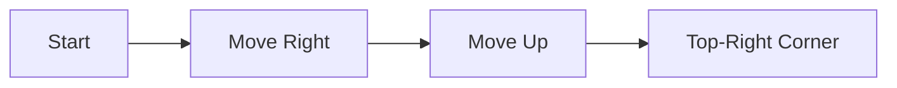

**Spatial Aptitude**
====================

**Introduction**
---------------

Spatial aptitude is a crucial aspect of problem-solving, particularly in fields like Computer Science and Engineering. It involves reasoning about spatial relationships between objects, understanding geometric transformations, and manipulating shapes to arrive at solutions. In this theory note, we'll delve into the core concepts, formulas, and techniques required to tackle questions that test spatial reasoning.

**Core Concepts**
----------------

### Grid Movement and Distance

When moving on a grid, the distance between two points can be calculated using the Manhattan distance (also known as L1 or taxicab geometry). For a 2D grid, the distance between points $(x_1, y_1)$ and $(x_2, y_2)$ is given by:

$$d = |x_2 - x_1| + |y_2 - y_1|$$

This concept is essential for understanding the movement of the ant in question Q1 (ee_2022_10).

### Trajectory and Path Optimization

The ant's goal is to reach the top-right corner while minimizing its distance. This requires finding an optimal trajectory, which can be visualized using a grid or coordinate system.

```mermaid
graph LR
A[Start] --> B[Move Right]
B --> C[Move Up]
C --> D[Top-Right Corner]
```

### Geometric Transformations

In the context of spatial aptitude, geometric transformations refer to operations that change the position, orientation, or size of a shape. These include:

* Translation (moving an object without rotating it)
* Rotation (rotating an object around a fixed point)
* Scaling (changing the size of an object)

Understanding these transformations is vital for visualizing and optimizing paths.

**Key Formulas/Theorems**
-------------------------

### Pythagorean Theorem

For a right-angled triangle with legs of length $a$ and $b$, and hypotenuse $c$:

$$c^2 = a^2 + b^2$$

This theorem is fundamental in calculating distances and understanding spatial relationships.

**Problem Solving Patterns**
---------------------------

### Elimination Based on Distance Rules

When solving questions involving grid movement, eliminate options that do not satisfy the distance conditions. For example, if an option requires moving more than one unit away from the starting point, eliminate it if it doesn't strictly decrease the current distance to the top-right corner.

### Analyzing Grid Movement

Visualize the grid and track the ant's movement step-by-step. Identify the optimal trajectory by eliminating options that do not satisfy the given constraints.

**Examples with Solutions**
---------------------------

### Q1 (ee_2022_10)

Consider the grid with the ant at point P:

P
P
The ant aims to move to the top-right corner while minimizing its distance. The correct answer is option B, which represents a possible trajectory of the ant during the movement.

Solution: By analyzing the grid and applying the distance rules, we can eliminate options A, C, and D as they do not strictly decrease the current distance to the top-right corner. Option B is the only valid solution.

**Common Pitfalls**
------------------

* Failing to apply distance rules when eliminating options
* Not considering geometric transformations (translation, rotation, scaling) in visualizing the trajectory
* Overlooking the importance of minimizing distance

**Quick Summary**
-----------------

* Grid movement and distance calculation using Manhattan distance
* Trajectory optimization by finding an optimal path
* Geometric transformations (translation, rotation, scaling)
* Elimination based on distance rules
* Analyzing grid movement to identify the correct trajectory