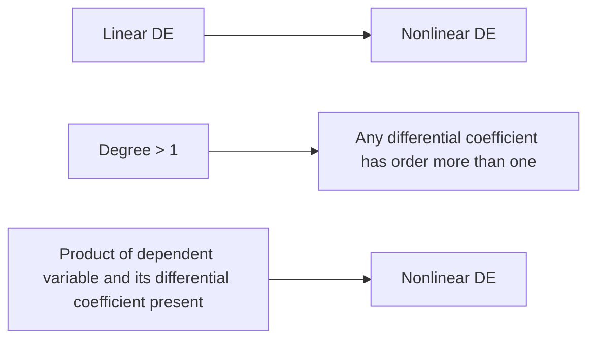

**Differential Equations**
=========================

### Introduction

A differential equation (DE) is an equation that involves an unknown function and its derivatives. DEs are used to model various phenomena in fields like physics, engineering, economics, and biology. The goal of solving a DE is to find the unknown function that satisfies the equation.

### Core Concepts

#### Types of Differential Equations

*   **Linear Differential Equation**: A linear DE has the form $F(x)y' + G(x)y = H(x)$, where $F$, $G$, and $H$ are functions of $x$.
*   **Nonlinear Differential Equation**: A nonlinear DE does not fit the above form.

#### Characteristics of Nonlinear Differential Equations

A differential equation is non-linear if:

1.  Its degree is more than one.
2.  Any one of differential coefficients has order more than one.
3.  Products containing dependent variable and its differential coefficient are present.

### Key Formulas/Theorems

$$\frac{dy}{dx} = f(x,y) \tag{1}$$

This is a first-order DE, where $f$ is a function of $x$ and $y$. We can use various methods to solve this equation, including separation of variables, substitution, and integrating factor.

For higher-order DEs, we need to introduce more notation:

$$\frac{d^2y}{dx^2} = f(x,y, \frac{dy}{dx}) \tag{2}$$

This is a second-order DE, where $f$ is now a function of $x$, $y$, and $\frac{dy}{dx}$.

### Problem Solving Patterns

To solve a nonlinear DE, we need to use various techniques, including:

*   **Separation of Variables**: Rearrange the equation so that one side depends only on the unknown function and its derivatives.
*   **Substitution Method**: Introduce a new variable to simplify the equation.
*   **Integrating Factor**: Multiply both sides by an integrating factor to make the left-hand side integrable.

### Examples with Solutions

**Example 1**

Solve the DE: $\frac{dy}{dx} = xy^2$

Solution:

$$\int \frac{dy}{y^2} = \int x dx$$

$$-\frac{1}{y} = \frac{x^2}{2} + C$$

where $C$ is a constant.

**Example 2**

Solve the DE: $\frac{d^2y}{dx^2} + y = 0$

Solution:

Let $p = \frac{dy}{dx}$, then we have:

$$\frac{dp}{dx} + p = 0$$

This is a first-order linear DE. We can solve it using integrating factor:

$$p(x) = Ce^{-x}$$

where $C$ is a constant.

Integrating this result, we get:

$$y(x) = C_1 e^{-x} + C_2$$

where $C_1$ and $C_2$ are constants.

### Common Pitfalls

*   **Incorrect classification of DE**: Be careful when classifying a DE as linear or nonlinear.
*   **Insufficient use of notation**: Use proper notation to distinguish between different variables and their derivatives.

### Quick Summary

| Topic | Description |
| --- | --- |
| Differential Equation | An equation that involves an unknown function and its derivatives. |
| Linear Differential Equation | A DE with the form $F(x)y' + G(x)y = H(x)$. |
| Nonlinear Differential Equation | A DE that does not fit the above form. |
| Characteristics of Nonlinear DEs | The degree is more than one, or any one of differential coefficients has order more than one, or products containing dependent variable and its differential coefficient are present. |
| Key Formulas/Theorems | Separation of variables, substitution method, integrating factor for solving nonlinear DEs. |

### Mermaid Diagram

This diagram illustrates the relationship between linear and nonlinear DEs, highlighting the key characteristics of nonlinear DEs.