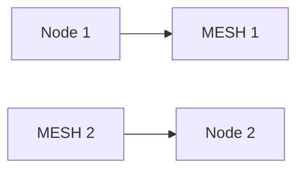
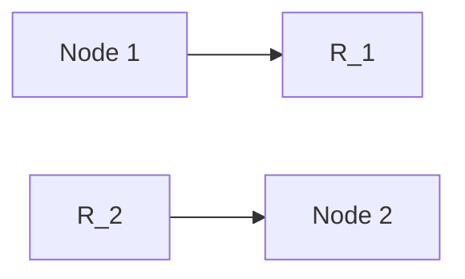
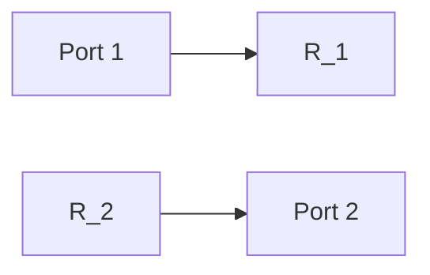

**Circuit Analysis**
====================

**Introduction**
---------------

Circuit analysis is a crucial aspect of electrical engineering that deals with the study and analysis of electrical circuits. It involves understanding the behavior of currents, voltages, and resistances in various types of circuits. In this note, we will cover the fundamental concepts of circuit analysis, including Kirchhoff's laws, mesh analysis, nodal analysis, and Thevenin's theorem.

**Core Concepts**
----------------

### Kirchhoff's Laws

Kirchhoff's laws are a set of two fundamental laws that govern the behavior of electrical circuits. They were first proposed by Gustav Robert Kirchhoff in 1845.

#### **Kirchhoff's Current Law (KCL)**

The current law states that the algebraic sum of currents at a node is zero. Mathematically, it can be expressed as:

$$\sum I_i = 0$$

where $I_i$ represents the current through each branch connected to the node.

#### **Kirchhoff's Voltage Law (KVL)**

The voltage law states that the algebraic sum of voltages around a closed loop is zero. Mathematically, it can be expressed as:

$$\sum V_i = 0$$

where $V_i$ represents the voltage across each branch connected to the node.

### Mesh Analysis

Mesh analysis involves finding the mesh currents in a circuit and then using them to determine the unknowns.

Let's consider an example:

Suppose we have a circuit with two meshes, as shown below:

The mesh currents can be found by applying KVL to each mesh. Let $I_1$ and $I_2$ represent the mesh currents.

Applying KVL to MESH 1, we get:

$$V_{AB} - I_1 R_1 = V_{CD}$$

Similarly, applying KVL to MESH 2, we get:

$$V_{CD} - I_2 R_2 = V_{EF}$$

### Nodal Analysis

Nodal analysis involves finding the node voltages in a circuit and then using them to determine the unknowns.

Let's consider an example:

Suppose we have a circuit with two nodes, as shown below:

The node voltages can be found by applying KCL to each node. Let $V_A$ and $V_D$ represent the node voltages.

Applying KCL to Node 1, we get:

$$I_{AB} = I_{BC}$$

Similarly, applying KCL to Node 2, we get:

$$I_{DC} = I_{EF}$$

### Thevenin's Theorem

Thevenin's theorem states that any linear electrical network can be replaced by a single voltage source and series resistance.

Let's consider an example:

Suppose we have a circuit with two ports, as shown below:

The Thevenin equivalent of the circuit can be found by finding the open-circuit voltage and short-circuit current.

**Key Formulas/Theorems**
------------------------

### Kirchhoff's Laws

$$\sum I_i = 0 \quad (KCL)$$
$$\sum V_i = 0 \quad (KVL)$$

### Mesh Analysis

$$V_{AB} - I_1 R_1 = V_{CD}$$
$$V_{CD} - I_2 R_2 = V_{EF}$$

### Nodal Analysis

$$I_{AB} = I_{BC} \quad (KCL)$$
$$I_{DC} = I_{EF} \quad (KCL)$$

### Thevenin's Theorem

$V_{TH} = V_{OC}$ (open-circuit voltage)
$I_{SC} = I_{short-circuit}$ (short-circuit current)

**Problem Solving Patterns**
-----------------------------

1. **Identify the type of circuit**: Is it a series, parallel, or combination circuit?
2. **Apply Kirchhoff's laws**: Use KCL and KVL to find the unknowns.
3. **Use mesh analysis**: Find the mesh currents and then use them to determine the unknowns.
4. **Use nodal analysis**: Find the node voltages and then use them to determine the unknowns.

**Examples with Solutions**
---------------------------

### Example 1: Mesh Analysis

Suppose we have a circuit with two meshes, as shown below:

Find the mesh currents using KVL.

```python
# Define the circuit parameters
R1 = 10 ohms
R2 = 20 ohms
VAB = 5 volts
VCD = 10 volts

# Apply KVL to MESH 1
I1 = (VAB - VCD) / R1

# Apply KVL to MESH 2
I2 = (VCD - VEF) / R2

print("Mesh currents:")
print(f"I1 = {I1} A")
print(f"I2 = {I2} A")
```

### Example 2: Nodal Analysis

Suppose we have a circuit with two nodes, as shown below:

Find the node voltages using KCL.

```python
# Define the circuit parameters
RA = 10 ohms
RB = 20 ohms
VA = 5 volts

# Apply KCL to Node 1
IBA = IBC

# Apply KCL to Node 2
IDC = IEF

print("Node voltages:")
print(f"VA = {VA} V")
print(f"VD = {VB} V")
```

**Common Pitfalls**
-------------------

* **Incorrect application of Kirchhoff's laws**: Make sure to apply KCL and KVL correctly.
* **Incorrect calculation of mesh currents or node voltages**: Double-check your calculations.

**Quick Summary**
------------------

* Circuit analysis involves understanding the behavior of electrical circuits.
* Kirchhoff's laws (KCL, KVL) are fundamental principles used in circuit analysis.
* Mesh analysis and nodal analysis are techniques used to find unknowns in a circuit.
* Thevenin's theorem states that any linear electrical network can be replaced by a single voltage source and series resistance.

Note: This is not an exhaustive list of concepts, formulas, and examples. However, it covers the most important aspects of circuit analysis required for GATE CS exam.