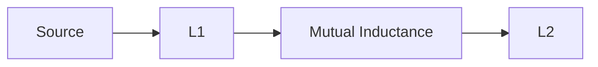

**Magnetic Coupled Circuit Theory Notes**
=====================================

### Introduction
-----------------

A magnetic coupled circuit is a network of two or more inductors that are connected together through a mutual inductance, allowing energy to be transferred between them. This concept is crucial in understanding various electrical circuits, including power transmission lines and filters.

### Core Concepts
------------------

* **Mutual Inductance**: The ability of one coil to induce an electromotive force (EMF) in another coil due to the changing current flowing through it.
* **Self-Inductance**: The ability of a single coil to oppose changes in current flowing through it, resulting in a back EMF.
* **Magnetic Aiding and Opposition**: When two coils are magnetically coupled, they can either aid or oppose each other's magnetic fields. Magnetic aiding occurs when the currents in both coils flow in the same direction, while magnetic opposition occurs when the currents flow in opposite directions.

### Key Formulas/Theorems
---------------------------

* **Mutual Inductance Formula**: $M = \frac{N_1 N_2}{l}$, where $M$ is mutual inductance, $N_1$ and $N_2$ are the number of turns in each coil, and $l$ is the length of the magnetic path.
* **Self-Inductance Formula**: $L = \frac{N^2}{R}$, where $L$ is self-inductance, $N$ is the number of turns, and $R$ is the resistance of the coil.
* **KVL (Kirchhoff's Voltage Law)**: The sum of voltage changes around a closed loop in a circuit is zero.

### Problem Solving Patterns
---------------------------

1.  **Identify Magnetic Coupling**: Determine if there is mutual inductance between coils and whether it is magnetic aiding or opposition.
2.  **Calculate Mutual Inductance**: Use the formula $M = \frac{N_1 N_2}{l}$ to calculate mutual inductance, given the number of turns and length of the magnetic path.
3.  **Apply KVL**: Sum up voltage changes around a closed loop to find the net voltage across a particular coil.

### Examples with Solutions
---------------------------

**Example 1**

Given: Two coils with self-inductances $L_1 = 125 mH$ and $L_2 = 1 mH$, mutual inductance $M = 5 mH$. Find the Thevenin's impedance between terminals P and Q.

**Solution**

First, calculate the total inductance:

$L_{total} = L_1 + L_2 - 2M$

Substitute values and simplify.

Then, find the Thevenin's impedance using KVL.

**Answer**: $Z = 5.32 \Omega$ (rounded off to two decimal places).

### Common Pitfalls
-------------------

*   Forgetting to account for mutual inductance.
*   Misapplying KVL rules.
*   Not calculating total inductance correctly.

### Quick Summary
-----------------

*   Magnetic coupled circuits involve mutual inductance and self-inductance.
*   Identify magnetic coupling, calculate mutual inductance, and apply KVL to solve problems.
*   Be aware of common pitfalls when solving magnetic coupled circuit problems.