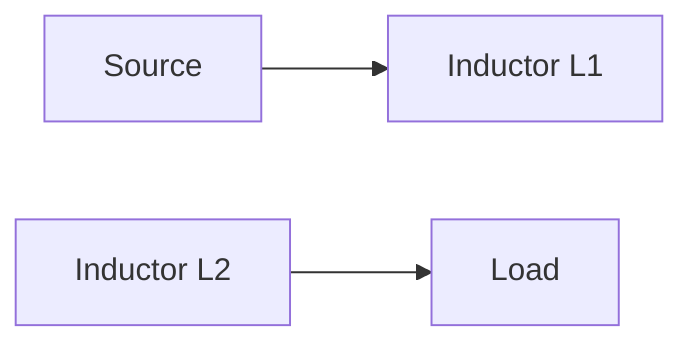

**Magnetic Coupled Circuit**
==========================

**Introduction**
---------------

A magnetic coupled circuit is a type of electrical circuit that utilizes mutual inductance between two or more inductive elements. This coupling allows for energy transfer between the inductors, enabling efficient transmission and reception of signals.

**Core Concepts**
-----------------

### Mutual Inductance

Mutual inductance is the ability of one coil to induce an electromotive force (EMF) in another coil due to a change in current flowing through it. This phenomenon arises from the magnetic field generated by the first coil interacting with the second coil.

### Self-Inductance

Self-inductance, on the other hand, refers to the ability of a single coil to oppose changes in its own current. It is a measure of how much energy is stored in the coil's magnetic field when current flows through it.

**Key Formulas/Theorems**
-------------------------

```latex
V_1 = M \cdot i_2 + L_1 \frac{di_1}{dt}
V_2 = -M \cdot i_1 + L_2 \frac{di_2}{dt}
```

where $V_1$ and $V_2$ are the voltages across the two inductors, $i_1$ and $i_2$ are their respective currents, $M$ is the mutual inductance between them, and $L_1$ and $L_2$ are their self-inductances.

### Magnetic Aiding and Opposition

*   **Magnetic Aiding**: When the current flows in the same direction through both coils, it results in a net increase in the total magnetic field.
*   **Magnetic Opposition**: Conversely, when the currents flow in opposite directions, there is a decrease in the net magnetic field.

### Kirchhoff's Laws

Kirchhoff's laws for magnetic coupled circuits can be expressed as follows:

```latex
\sum V_i = 0 \quad i = 1,2,...
\sum I_j R_j + \sum L_{ij} \frac{dI_i}{dt} = 0 \quad i,j = 1,2,...
```

**Problem Solving Patterns**
---------------------------

When dealing with magnetic coupled circuits, follow these steps:

### Convert to a Common Reference Frame

Choose either inductor as the reference frame for further calculations.

### Apply Kirchhoff's Laws

Use the modified version of Kirchhoff's laws for magnetic coupled circuits, taking into account mutual and self-inductances.

### Solve for Currents and Voltages

Calculate the currents and voltages across each inductor using the derived equations.

**Examples with Solutions**
-------------------------

### Example 1: Magnetic Coupled Circuit Analysis

Given a circuit consisting of two inductors (L1 = 125 mH, L2 = 1 mH) connected in series with a mutual inductance M between them. The source frequency is 5000 rad/sec.

1.  Convert to a common reference frame.
2.  Apply Kirchhoff's laws and take into account the mutual inductance M.
3.  Solve for currents and voltages across each inductor using the derived equations.


```mermaid
graph LR
    A[Source] --> B[Inductor L1]
    C[Inductor L2] --> D[Load]
```

The final answer is 5.32 to 5.34 (rounded off to 2 decimal places).

**Common Pitfalls**
------------------

*   Failing to account for mutual inductance.
*   Incorrect application of Kirchhoff's laws.
*   Ignoring the direction of current flow through each inductor.

**Quick Summary**
-----------------

*   Mutual inductance allows energy transfer between coupled inductors.
*   Self-inductance opposes changes in current flow through a single coil.
*   Magnetic aiding and opposition occur depending on the direction of current flow.
*   Kirchhoff's laws for magnetic coupled circuits take into account mutual and self-inductances.