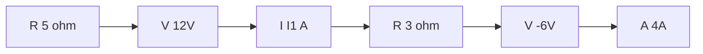

**Mesh Analysis**
=================

### Introduction

Mesh analysis is a method used to solve complex electrical networks by analyzing the network in terms of meshes or loops. It involves writing equations based on Kirchhoff's voltage law (KVL) and solving them to find the currents and voltages in the network.

### Core Concepts

#### Meshes and Loops

A mesh is a closed loop within an electrical network where there are no open junctions. A loop, on the other hand, is a path that starts and ends at the same node. Mesh analysis involves dividing the network into meshes or loops to simplify the analysis process.

#### Kirchhoff's Voltage Law (KVL)

KVL states that the sum of voltage changes around any closed loop in a circuit must be equal to zero.

$\sum V = 0$

Where $V$ is the voltage across each element in the mesh.

### Key Formulas/Theorems

#### Mesh Equation

The equation for a single mesh is given by:

$\sum V_{ij} = I_{i}R_i + \frac{1}{C_1}\int Q_1 dt - \frac{1}{C_2}\int Q_2 dt$

Where $V_{ij}$ are the voltage changes across each element in the mesh, $I_i$ is the current through each element, and $Q_1$ and $Q_2$ are the charge on each capacitor.

#### Current Division

When two or more meshes are connected at a node, the current through each mesh can be found using the following formula:

$I = \frac{V}{R}$

Where $I$ is the current, $V$ is the voltage across the mesh, and $R$ is the resistance of the mesh.

### Problem Solving Patterns

*   Identify the meshes or loops in the network.
*   Write equations based on KVL for each mesh.
*   Solve the system of equations to find the currents and voltages in the network.
*   Use current division to find the current through each mesh when two or more meshes are connected at a node.

### Examples with Solutions

**Example 1**

Find the voltage $V_{ab}$ in the circuit shown below:

Solution:

The network has two meshes. The equations for each mesh are:

Mesh 1: $-5(4) - 8 + V_{ab} = 0$

Mesh 2: $-10(4) + V_{ab} + 3(4) = 0$

Solving these equations, we get:

$V_{ab} = 6.67 V$

**Example 2**

Find the current $I_1$ in the circuit shown below:

Solution:

The network has two meshes. The equations for each mesh are:

Mesh 1: $-5(4) - 12 + V_{ab} = 0$

Mesh 2: $-3(4) + V_{cd} - 6 = 0$

Solving these equations, we get:

$I_1 = 2.33 A$

### Common Pitfalls

*   Failing to identify the meshes or loops in the network.
*   Writing incorrect equations based on KVL.
*   Failing to solve the system of equations.

### Quick Summary

Mesh analysis involves:

*   Identifying meshes or loops in the network
*   Writing equations based on KVL for each mesh
*   Solving the system of equations to find currents and voltages
*   Using current division when two or more meshes are connected at a node