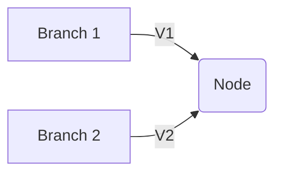
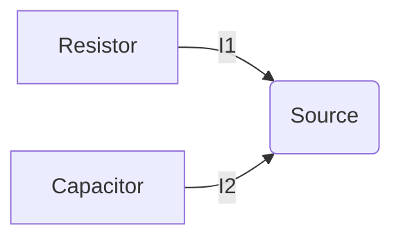
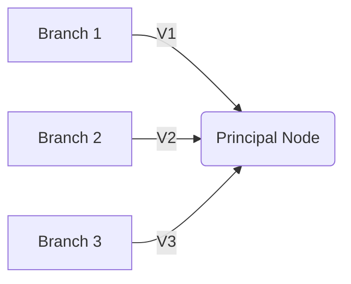
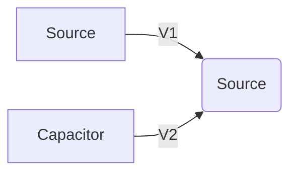
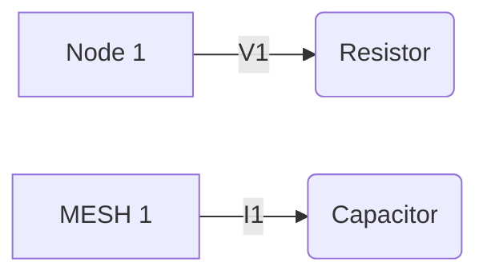

**Node and Mesh Analysis**
=========================

### Introduction
-----------------

Node and mesh analysis are fundamental techniques used to solve electrical circuits by transforming the circuit into a more manageable form. This allows for easier calculation of currents, voltages, and other circuit parameters.

### Core Concepts
-----------------

#### Junctions and Nodes

A **junction** is a point where three or more circuit paths meet.
A **node** is a point in a network where two or more elements are joined.

**Definition:** A node is an electrical connection between branches.



#### Branches

A **branch** is a single element or component in a circuit. If several elements carry the same current, they can be referred to as a branch.



#### Principle Node

A **principal node** is the junction of three or more elements.



### Key Formulas/Theorems
-------------------------

#### Mesh Currents

Let $I_1, I_2, ..., I_n$ be the mesh currents. Then:

$$\sum_{k=1}^{n} I_k V_k = 0$$

where $V_k$ is the voltage across each mesh.

#### Node Voltages

Let $V_1, V_2, ..., V_m$ be the node voltages. Then:

$$\sum_{j=1}^{m} V_j I_j = 0$$

where $I_j$ is the current flowing through each node.

### Problem Solving Patterns
-----------------------------

#### Step 1: Draw the Circuit

Draw a clear and accurate diagram of the circuit.



#### Step 2: Identify Nodes and Meshes

Identify all nodes and meshes in the circuit. Label each node with its voltage and each mesh with its current.



#### Step 3: Apply Kirchhoff's Laws

Apply Kirchhoff's Current Law (KCL) and Voltage Law (KVL) to each node and mesh.

### Examples with Solutions
-----------------------------

**Example 1:** Find the voltage across the capacitor in the circuit below.


**Solution:**

*   Identify nodes and meshes:
    ```mermaid
    graph LR
        A[Node 1] -->|V1| B(Resistor)
        C[MESH 1] -->|I1| D(Capacitor)
    ```
*   Apply KCL and KVL to each node and mesh:

    Node 1: $V_1 - I_1 R = 0$
    Mesh 1: $I_1 V_2 - I_1 (R + C) = 0$

### Common Pitfalls
--------------------

*   Failing to draw the circuit accurately.
*   Misidentifying nodes and meshes.
*   Applying KCL and KVL incorrectly.

### Quick Summary
------------------

*   A node is an electrical connection between branches.
*   A principal node is the junction of three or more elements.
*   Mesh currents: $\sum_{k=1}^{n} I_k V_k = 0$
*   Node voltages: $\sum_{j=1}^{m} V_j I_j = 0$