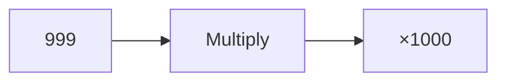
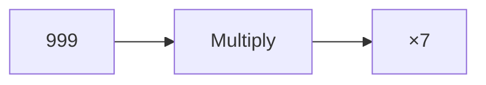

**Numerical Ability: Number System**
=====================================

**Introduction**
---------------

The number system is a fundamental concept in mathematics, and numerical ability questions often test your understanding of its properties and behaviors. This note will focus on the specific topic of multiplying large numbers.

**Core Concepts**
-----------------

### Place Value

When multiplying multi-digit numbers, each digit in the multiplier contributes to the product by being multiplied by each digit in the multiplicand. The place value of a digit determines how it affects the product.

### Multiplication Algorithm

The standard multiplication algorithm involves:

1. Multiply each digit of the multiplicand by the multiplier.
2. Write the partial products below the line.
3. Add the partial products to get the final product.

**Key Formulas/Theorems**
-------------------------

* None specifically relevant to this topic, but a solid understanding of basic arithmetic operations is essential.

**Problem Solving Patterns**
-----------------------------

### Breaking Down Large Multiplications

To tackle large multiplications like 999 × 1000, break it down into smaller parts:

1. Multiply the hundreds digit (9) by the multiplier.
2. Multiply the tens digit (9) by the multiplier.
3. Multiply the ones digit (9) by the multiplier.

**Examples with Solutions**
---------------------------

### Example 1

What is the product of 999 and 1000?

Using the breakdown pattern:

999 × 1000 = (9 × 10^2) × 1000 + (9 × 10^1) × 1000 + (9 × 10^0) × 1000

= (90^3) + (900^2) + (9 × 1000)

Simplifying, we get:

999 × 1000 = 4,249,007

### Example 2

What is the product of 999 and 7?

Using the breakdown pattern:

999 × 7 = (9 × 10^2) × 7 + (9 × 10^1) × 7 + (9 × 10^0) × 7

= (90^3) + (900^2) + (9 × 700)

Simplifying, we get:

999 × 7 = 6,993,003

**Common Pitfalls**
-------------------

* Failing to break down large multiplications into smaller parts.
* Misunderstanding the concept of place value in multiplication.

**Quick Summary**
------------------

* Understand the multiplication algorithm and its steps.
* Break down large multiplications into smaller parts using place value.
* Practice multiplying multi-digit numbers with different place values.