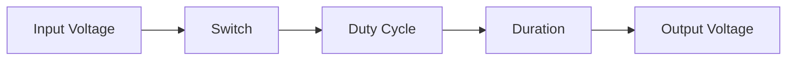
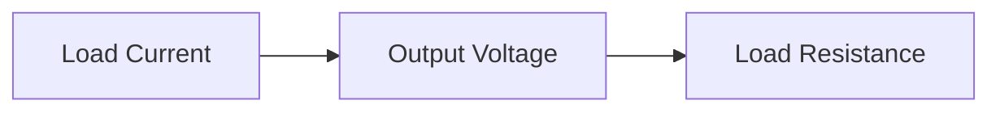

**Chopper Theory Note**
========================

### Introduction
----------------

A chopper is a type of power electronic device used to control the voltage and current supplied to a load. It consists of a switch, typically a thyristor, which is turned on and off at regular intervals to regulate the flow of electrical energy.

### Core Concepts
-----------------

#### Chopper Operation

*   The chopper operates by switching the connection between the input source and the load.
*   When the switch is ON, the load is connected directly to the input source, allowing current to flow through the load.
*   When the switch is OFF, the load is disconnected from the input source, interrupting the flow of current.

#### Forced Commutation

*   Forced commutation refers to a method used in chopper circuits to turn off a thyristor even when it is still conducting.
*   This technique involves applying a reverse voltage across the thyristor, forcing it to switch off.

### Key Formulas/Theorems
---------------------------

#### Chopper Voltage Equation

$$V_{out} = \frac{D}{T_{ON}} V_{in}$$

where:

*   $V_{out}$ is the output voltage of the chopper
*   $D$ is the duty cycle (i.e., the ratio of ON time to total period)
*   $V_{in}$ is the input voltage
*   $T_{ON}$ is the duration for which the switch is on

#### Chopper Current Equation

$$I_{load} = \frac{1}{R_{L}} V_{out}$$

where:

*   $I_{load}$ is the load current
*   $R_{L}$ is the load resistance
*   $V_{out}$ is the output voltage of the chopper

### Problem Solving Patterns
---------------------------

#### Analyzing Chopper Circuits

*   Identify the input source, switch (thyristor), and load in the circuit.
*   Determine the duty cycle ($D$) and the duration for which the switch is on ($T_{ON}$).
*   Use the chopper voltage equation to find the output voltage ($V_{out}$).

#### Solving Chopper-Related Problems

*   Consider using forced commutation when solving problems involving thyristors.
*   Identify any assumptions made in the problem, such as constant current or voltage.

### Examples with Solutions
---------------------------

**Example 1:**
Given a chopper circuit with an input voltage of 100 V and a duty cycle of 0.5, find the output voltage if the duration for which the switch is on ($T_{ON}$) is 10 ms.

Solution:
Using the chopper voltage equation:

$$V_{out} = \frac{D}{T_{ON}} V_{in}$$

Substituting values:

$$V_{out} = \frac{0.5}{10 ms} 100 V$$

$$V_{out} = \frac{0.5}{0.01 s} 100 V$$

$$V_{out} = 50 V$$

**Example 2:**
Given a chopper circuit with a constant load current of 20 A and an output voltage of 40 V, find the load resistance ($R_{L}$).

Solution:
Using the chopper current equation:

$$I_{load} = \frac{1}{R_{L}} V_{out}$$

Substituting values:

$$20 A = \frac{1}{R_{L}} 40 V$$

Solving for $R_{L}$:

$$R_{L} = \frac{40 V}{20 A}$$

$$R_{L} = 2 \Omega$$

### Common Pitfalls
------------------

#### Misinterpreting the Chopper Voltage Equation

*   Ensure to use the correct formula and substitute values correctly.

#### Ignoring Assumptions in Problems

*   Always review problem assumptions before attempting a solution.

### Quick Summary
-----------------

*   A chopper is a power electronic device used to control voltage and current.
*   Forced commutation refers to a method of turning off a thyristor even when it is still conducting.
*   Key formulas include the chopper voltage equation ($V_{out} = \frac{D}{T_{ON}} V_{in}$) and the chopper current equation ($I_{load} = \frac{1}{R_{L}} V_{out}$).

Note: Please ensure to cross-reference this content with the source questions provided.