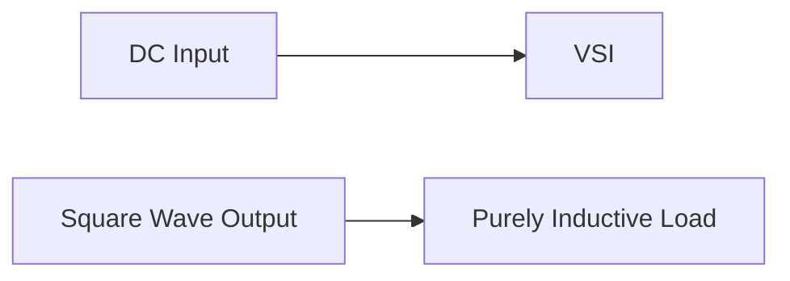

**Single Phase Bridge Voltage Source Inverter (VSI) Feeds a Purely Inductive Load**
===========================================================

### Introduction
A Single-Phase Bridge Voltage Source Inverter (VSI) is a type of power electronic converter that converts DC input voltage to AC output voltage. It consists of four semiconductor switches, typically IGBTs or MOSFETs, which are connected in a bridge configuration. The inverter feeds a purely inductive load, meaning the load has no resistive component.

### Core Concepts
The key concept here is that the inverter output voltage is a square wave in 0-180° conduction mode, with a fundamental frequency of 50 Hz. This means that the switches conduct for only half the cycle, resulting in a square waveform.

**Inductive Load**
----------------

* The load inductance is given as 20 mH.
* The DC input voltage of the inverter is 100 V.
* The fundamental frequency of the output voltage is 50 Hz.

### Key Formulas/Theorems
We will need the following formulas to solve this problem:

$$V_{L} = L \frac{di}{dt}$$

where $V_L$ is the induced voltage across the inductor, and $\frac{di}{dt}$ is the rate of change of current through the inductor.

### Problem Solving Patterns
To find the peak-to-peak load current, we can use the following steps:

1.  Find the RMS value of the output voltage using the formula:

$$V_{rms} = \frac{2V_m}{\pi}$$

where $V_m$ is the peak value of the square wave.
2.  Use Ohm's law to find the current through the inductor.

### Examples with Solutions
**Example:**

Find the peak-to-peak load current for a purely inductive load fed by a single-phase bridge voltage source inverter (VSI) with a DC input voltage of 100 V, a fundamental frequency of 50 Hz, and an inductance value of 20 mH.

**Solution:**

1.  Find the RMS value of the output voltage:

$$V_{rms} = \frac{2V_m}{\pi} = \frac{2(200)}{\pi} = 127.32 V$$
2.  Since we have a purely inductive load, the current is maximum when the switch conducts at maximum duty cycle (0° or 180°). The peak value of the square wave is:

$$V_m = V_{DC} = 100 V$$
3.  Use Ohm's law to find the peak current through the inductor:

$$I_{peak} = \frac{V_m}{X_L} = \frac{200}{2\pi fL} = \frac{200}{2\pi (50) (20e-3)} = 15.92 A$$
4.  The peak-to-peak load current is:

$$I_{pp} = 2 I_{peak} = 2(15.92) = 31.84 A$$

### Common Pitfalls
*   Students often forget to use the correct value of inductance (L) in calculations.
*   Using incorrect values for DC input voltage or fundamental frequency can lead to wrong results.

### Quick Summary
| Key Concept | Description |
| --- | --- |
| Single-Phase Bridge VSI | Type of power electronic converter that converts DC to AC output voltage. |
| Purely Inductive Load | Load with no resistive component, only inductive reactance. |
| Inductor Formulas | $V_L = L \frac{di}{dt}$ for induced voltage across the inductor. |

**Visuals**

I hope this comprehensive theory note helps you prepare for the GATE CS exam!