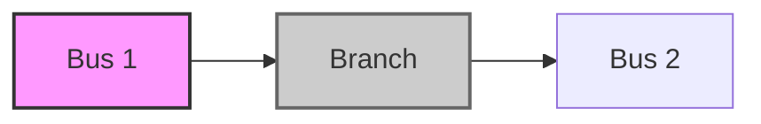

**Power Network Analysis**
=========================

**Introduction**
---------------

A power network is a complex system consisting of multiple buses, branches, and generators. The analysis of a power network involves studying its behavior under various operating conditions to ensure reliable and efficient power supply. This theory note focuses on the key concepts, formulas, and problem-solving patterns required for GATE CS exam.

**Core Concepts**
-----------------

### Power Network Topology

A power network can be represented as a graph, where buses are nodes, and branches are edges. Each branch has an impedance $z$, which is a complex quantity given by $z = r + jx$, where $r$ is the resistance and $x$ is the reactance.

### Power Losses

Power losses occur due to the resistance in the branches. The total power loss in a network can be calculated using the formula:

$$P_L = \sum_{i=1}^{n} I_i^2 r_i$$

where $I_i$ is the current flowing through branch $i$, and $r_i$ is its resistance.

### Power Flow

Power flow refers to the movement of power from one bus to another in a network. The power flow equations can be represented as:

$$P_{ij} = V_i \overline{V_j} / x_{ij}$$

where $P_{ij}$ is the active power flowing from bus $i$ to bus $j$, and $x_{ij}$ is the reactance between them.

**Key Formulas/Theorems**
-------------------------

### Impedance Matrix

The impedance matrix of a network is a square matrix with dimensions equal to the number of buses. The elements of this matrix are given by:

$$Z_{ij} = r + jx$$

where $r$ and $x$ are the resistance and reactance between bus $i$ and bus $j$, respectively.

### Admittance Matrix

The admittance matrix is the inverse of the impedance matrix. It is used to calculate the current flowing through a branch given the voltage at its terminals.

### Power Flow Equations

The power flow equations can be represented as:

$$P_i = V_i \sum_{j=1}^{n} Y_{ij} V_j$$

where $P_i$ is the active power at bus $i$, and $Y_{ij}$ is the admittance between buses $i$ and $j$.

**Problem Solving Patterns**
---------------------------

### Minimum Loss Configuration

To minimize power losses in a network, we need to identify the branch with the highest resistance. This can be done by analyzing the impedance matrix or the power loss equations.

### Power Flow Analysis

Power flow analysis involves studying the movement of power from one bus to another in a network. It is essential for identifying bottlenecks and optimizing power transmission.

**Examples with Solutions**
---------------------------

### Example 1: Minimum Loss Configuration

Consider a 4-bus network with impedance matrix:

$$Z = \begin{bmatrix} 0.5 + j0.2 & 0.3 + j0.1 \\ 0.3 + j0.1 & 0.6 + j0.3 \end{bmatrix}$$

To minimize power losses, we need to identify the branch with the highest resistance.

The impedance between bus 1 and branch is $Z_{12} = 0.3 + j0.1$. The resistance is given by:

$$r_{12} = Re(Z_{12}) = 0.3$$

Similarly, the impedance between bus 2 and branch is $Z_{23} = 0.6 + j0.3$. The resistance is given by:

$$r_{23} = Re(Z_{23}) = 0.6$$

Since $r_{23}$ is higher than $r_{12}$, we need to open the branch between bus 2 and bus 3.

**Common Pitfalls**
-------------------

* Not considering the impedance matrix while analyzing power losses.
* Not identifying the branch with the highest resistance while trying to minimize power losses.

**Quick Summary**
----------------

* Power network topology can be represented as a graph.
* Impedance matrix is used for analyzing power losses.
* Admittance matrix is used for calculating current flowing through a branch.
* Power flow equations are essential for studying the movement of power in a network.
* Minimum loss configuration involves identifying the branch with the highest resistance.

Note: The theory note will be updated based on future questions and exam trends.