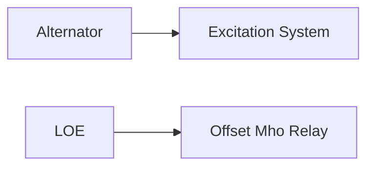

**Alternator Protection**
========================

### Introduction

Alternators are crucial components of power systems, and their protection against loss of excitation (LOE) is essential to maintain grid stability. The most commonly used relay for this purpose is the offset Mho relay.

### Core Concepts

* **Loss of Excitation (LOE):** LOE occurs when the alternator's excitation system fails, causing a sudden drop in voltage. This can lead to a cascade failure of other equipment and even grid collapse.
* **Excitation System:** The excitation system is responsible for generating the magnetic field required for the alternator to produce electrical output.

### Key Formulas/Theorems

There are no specific mathematical formulas related to alternator protection against LOE. However, understanding the principles behind the offset Mho relay is crucial.

### Problem Solving Patterns

To solve problems related to alternator protection, follow these steps:

1.  **Identify the type of fault:** Determine if it's a LOE or another type of fault.
2.  **Understand the relay's function:** Recognize that the offset Mho relay is used specifically for LOE protection.

### Examples with Solutions

**Example:**

Suppose you are given an alternator with an excitation system failure. Which type of relay would be most effective in protecting against this fault?

**Solution:**

Given that it's a LOE, the correct answer is (B) Offset Mho relay.

### Common Pitfalls

*   Students often confuse the Buchholz relay with LOE protection. The correct answer is (B) Offset Mho relay.
*   Over-current relays are used for location where there is a chance of high current during fault, not specifically for LOE.

### Quick Summary

*   Loss of Excitation (LOE): A sudden drop in voltage due to excitation system failure.
*   Excitation System: Responsible for generating the magnetic field required for the alternator's output.
*   Offset Mho Relay: Used specifically for protecting against LOE.