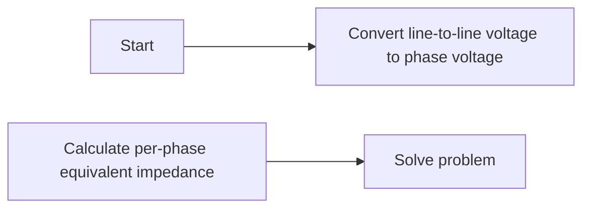

**Balanced Three-Phase Circuit**
=====================================

**Introduction**
---------------

A balanced three-phase circuit consists of three identical loads connected to a three-phase supply. The key characteristics of such circuits are symmetry and equal phase voltages and currents.

**Core Concepts**
-----------------

### Phase Voltage and Current

In a three-phase system, each phase has the same RMS voltage ($V_{ph}$) or current ($I_{ph}$).

\[ V_{LL} = \sqrt{3} \cdot V_{ph} \]

where $V_{LL}$ is the line-to-line voltage.

### Per-Phase Equivalent Impedance

For a balanced three-phase circuit, we can calculate the per-phase equivalent impedance by dividing the total impedance by 3:

\[ Z_p = \frac{Z_T}{3} \]

where $Z_p$ is the per-phase equivalent impedance and $Z_T$ is the total impedance.

### Phasor Representation

Phasors are a convenient way to represent AC circuits. In a balanced three-phase circuit, each phase can be represented as a phasor with an angle $\phi$ between them:

\[ \phi = 120^\circ \]

**Key Formulas/Theorems**
-------------------------

*   Per-phase equivalent impedance: $Z_p = \frac{Z_T}{3}$
*   Line-to-line voltage in terms of phase voltage: $V_{LL} = \sqrt{3} \cdot V_{ph}$
*   Phase angle between phases: $\phi = 120^\circ$

**Problem Solving Patterns**
-----------------------------

1.  **Convert line-to-line voltage to phase voltage**: Divide the line-to-line voltage by $\sqrt{3}$.
2.  **Calculate per-phase equivalent impedance**: Divide the total impedance by 3.

**Examples with Solutions**
---------------------------

### Example 1

A balanced three-phase circuit has a line-to-line voltage of $100\ \Omega$. Calculate the phase voltage:

\[ V_{ph} = \frac{V_{LL}}{\sqrt{3}} = \frac{100}{\sqrt{3}} = 57.74\ \Omega \]

### Example 2

A balanced three-phase circuit has a per-phase equivalent impedance of $20\ \Omega$. Calculate the total impedance:

\[ Z_T = 3 \cdot Z_p = 3 \cdot 20 = 60\ \Omega \]

**Common Pitfalls**
-------------------

*   Forgetting to convert line-to-line voltage to phase voltage.
*   Calculating total impedance instead of per-phase equivalent impedance.

**Quick Summary**
------------------

*   Balanced three-phase circuit consists of three identical loads connected to a three-phase supply.
*   Key characteristics: symmetry, equal phase voltages and currents.
*   Per-phase equivalent impedance: $Z_p = \frac{Z_T}{3}$
*   Line-to-line voltage in terms of phase voltage: $V_{LL} = \sqrt{3} \cdot V_{ph}$
*   Phase angle between phases: $\phi = 120^\circ$

**Mermaid Diagram**
-------------------

This comprehensive theory note covers all theoretical concepts, formulas, and insights required to solve questions related to balanced three-phase circuits. It includes detailed explanations of core concepts, key formulas/theorems, problem-solving patterns, examples with solutions, common pitfalls, and a quick summary for revision.