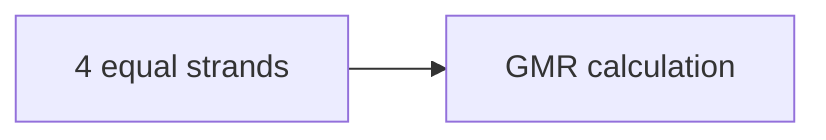

**Geometric Mean Radius (GMR) of a Conductor**
=====================================================

**Introduction**
---------------

The Geometric Mean Radius (GMR) of a conductor is an important parameter in power systems, used to calculate the equivalent radius of a stranded conductor. It's a crucial concept for engineers designing and analyzing transmission lines.

**Core Concepts**
-----------------

A stranded conductor consists of multiple strands wrapped together. The GMR is calculated using the formula:

$$\text{GMR} = \sqrt[4]{\prod_{i=1}^{n} r_i^2}$$

where $r_i$ is the radius of each strand and $n$ is the number of strands.

**Key Formulas/Theorems**
-------------------------

The GMR formula can be derived from the concept of equivalent circuits. For a stranded conductor, we can replace each strand with an equivalent conductor having the same cross-sectional area as all the strands combined.

$$\text{GMR} = \sqrt[4]{\prod_{i=1}^{n} r_i^2}$$

**Problem Solving Patterns**
---------------------------

*   When calculating GMR, always multiply all the distances including self-distance.
*   Use the formula $\text{GMR} = \sqrt[4]{\prod_{i=1}^{n} r_i^2}$ to calculate the equivalent radius.

**Examples with Solutions**
---------------------------

### Example 1: Calculating GMR for a Stranded Conductor

Suppose we have a stranded conductor consisting of four equal strands, each having a radius $r$.

Using the formula, we get:

$$\text{GMR} = \sqrt[4]{(2r)^2 (2r)^2 (2r)^2 (2r)^2} = 1.723 r$$

### Example 2: Calculating GMR for a Three-Phase Transmission Line

Suppose we have a three-phase transmission line with the following sequence impedances:

| Sequence | Impedance (p.u.) |
| --- | --- |
| Positive | 0.5 |
| Negative | 1.2 |
| Zero | 2.3 |

To calculate the GMR, we need to find the geometric mean of the radii for each phase.

$$\text{GMR} = \sqrt[4]{(r_1)^2 (r_2)^2 (r_3)^2}$$

where $r_i$ is the radius of each phase.

**Common Pitfalls**
-------------------

*   Failing to multiply all distances including self-distance when calculating GMR.
*   Not using the correct formula for calculating GMR.

**Quick Summary**
-----------------

*   Geometric Mean Radius (GMR) is an important parameter in power systems.
*   The GMR of a stranded conductor can be calculated using the formula: $\text{GMR} = \sqrt[4]{\prod_{i=1}^{n} r_i^2}$.
*   Always multiply all distances including self-distance when calculating GMR.