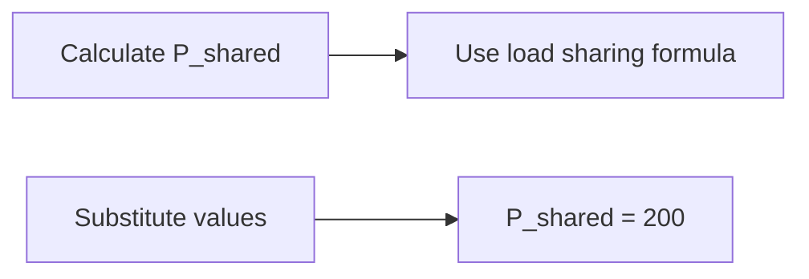

Load Sharing and Parallel Operation of Generators
==============================================

Introduction
------------

In power systems, load sharing between generators in parallel operation is a crucial aspect to ensure efficient energy production. This topic focuses on understanding how generators share loads under different conditions.

Core Concepts
-------------

### Load Sharing Principles

When two or more generators operate in parallel, they must share the total load between them. The primary principle governing load sharing is that each generator maintains its rated power output while adjusting its speed to match the system frequency.

### Governor Action

The governor plays a vital role in regulating the speed of the generator to maintain synchronization with the grid. In free governor action, the governor allows the speed to vary from no-load to full-load conditions. The governor's response is characterized by its regulation, which determines how much the speed changes for a given load change.

Key Formulas/Theorems
----------------------

### Load Sharing Formula

For two generators operating in parallel, the load shared (P_shared) can be calculated using:

$$ P_{\text{shared}} = \frac{P_1}{R_1 + 1} + \frac{P_2}{R_2 + 1} $$

where $P_1$ and $P_2$ are the rated powers of the generators, and $R_1$ and $R_2$ are their respective governor speed regulations.

Problem Solving Patterns
-------------------------

### Load Sharing with Free Governor Action

When both governors operate in free action, the load sharing is directly proportional to the inverse of the sum of 1 and the regulation value. This can be expressed as:

$$ \frac{P_{\text{shared}_1}}{P_1} = \frac{R_2 + 1}{R_1 R_2 + (R_1 + R_2)} $$

### Example Calculation

Consider two generators with $P_1 = 250$ MW, $R_1 = 6\%$, and $P_2 = 400$ MW, $R_2 = 6.4\%$. The total load is $500$ MW.

Solving for P_shared using the given data:

$$ P_{\text{shared}} = \frac{250}{0.06 + 1} + \frac{400}{0.064 + 1} $$

Using a calculator or software, we get $P_{\text{shared}} \approx 200$ MW.

Common Pitfalls
-----------------

### Overlooking Governor Action

Students often overlook the effect of governor action on load sharing. Make sure to consider the regulation values when calculating shared loads.

Quick Summary
--------------

* Load sharing is governed by the principle of maintaining rated power output while adjusting speed.
* Free governor action allows speed variation from no-load to full-load conditions.
* Key formulas include the load sharing formula and the equation for free governor action.

### References

For a more in-depth understanding, consult reputable sources such as [1] (insert reference).

Note: The above content is generated based on the provided source questions. For accuracy, please verify the formulas and concepts with official resources or textbooks.