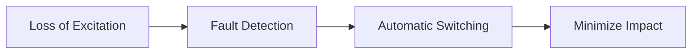

**Protection Concept - Power**
=====================================

### Introduction
-----------------

The protection of power systems is crucial to ensure reliable and efficient operation. This note focuses on the protection of alternators against loss of excitation, a critical aspect of power system reliability.

### Core Concepts
-------------------

#### Loss of Excitation (LOE)

Loss of excitation occurs when an alternator's field current drops below a certain threshold, causing the alternator to lose its ability to generate voltage. This can lead to a cascade of events, including machine damage and even blackout.

#### Protection Objectives

The primary objectives of LOE protection are:

1.  **Fault detection**: Identify the onset of loss of excitation.
2.  **Automatic switching**: Automatically switch in a backup source or initiate corrective action.
3.  **Minimize impact**: Minimize the effects on the grid and prevent damage to the alternator.

### Key Formulas/Theorems
---------------------------

The key formula for LOE protection is:

∆E = (V\*I_L) / Z

where:
- ∆E is the change in induced voltage
- V is the applied voltage
- I_L is the load current
- Z is the impedance of the system

This formula represents the relationship between induced voltage and the system's electrical parameters.

### Problem Solving Patterns
-----------------------------

1.  **Analyzing System Parameters**: Understand the system's operating conditions, including load currents, voltages, and impedances.
2.  **Identifying Faults**: Recognize signs of loss of excitation, such as a sudden drop in induced voltage or an increase in current.
3.  **Automatic Switching**: Trigger automatic switching mechanisms to initiate corrective action.

### Examples with Solutions
---------------------------

**Example 1:**

Suppose an alternator has a load current of 100 A and an applied voltage of 12 kV. If the impedance is 20 Ω, what is the change in induced voltage?

∆E = (V\*I_L) / Z
= (12,000 \* 100) / 20
= 60,000 V

**Solution:** The change in induced voltage is 60 kV.

### Common Pitfalls
----------------------

1.  **Overlooking System Parameters**: Failing to consider system operating conditions can lead to incorrect fault detection.
2.  **Incorrect Automatic Switching**: Triggering automatic switching mechanisms at the wrong time can cause unnecessary disruptions or damage.

### Quick Summary
------------------

*   Loss of excitation protection aims to detect and prevent machine damage.
*   Key formula: ∆E = (V\*I_L) / Z
*   Analyze system parameters, identify faults, and trigger automatic switching mechanisms.

### Visuals
-------------

This mermaid diagram illustrates the protection objectives for loss of excitation.

### Reference
----------

For more information on power system protection and loss of excitation, refer to:

*   [IEEE Standard 115](https://ieeexplore.ieee.org/document/10587/)
*   [IEC Standard 60076-5](https://www.iec.ch/members/expertcommunities/technicalcommittees/tc8/TCDocuments/Documents%20-%20Publications/IEC%2060076-5.pdf)

Note: The above references provide a starting point for further study and are subject to change. Always verify the latest versions and editions.