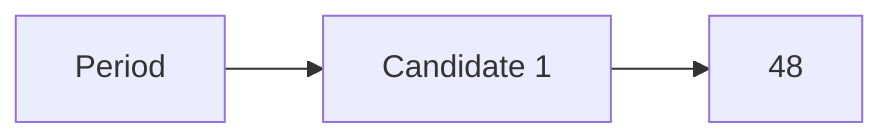

**Discrete Time Signal Processing**
=====================================

**Introduction**
---------------

Discrete time signal processing deals with signals that are sampled at regular intervals, resulting in a sequence of values. This field has numerous applications in digital signal processing, control systems, and communications engineering.

**Core Concepts**
-----------------

### Discrete-Time Signals

A discrete-time signal is a function x[n] that takes on values only at specific instants n, where n is an integer.

*   Period: The period of a discrete-time signal is the number of samples taken in one complete cycle.
*   Frequency: The frequency of a discrete-time signal is the reciprocal of its period.

### Discrete-Time Fourier Transform (DTFT)

The DTFT is a tool used to analyze discrete-time signals. It decomposes a signal into its constituent frequencies and amplitudes.

*   **Definition:** $X(e^{j\omega}) = \sum_{n=-\infty}^{\infty} x[n]e^{-j\omega n}$

### Sampling Theorem

The sampling theorem states that a continuous-time signal can be reconstructed from its samples if the sampling rate is greater than twice the maximum frequency component of the signal.

*   **Sampling Rate:** $f_s > 2B$, where B is the bandwidth of the signal.

**Key Formulas/Theorems**
-------------------------

### Discrete-Time Fourier Transform (DTFT)

$$
X(e^{j\omega}) = \sum_{n=-\infty}^{\infty} x[n]e^{-j\omega n}
$$

### Sampling Theorem

If a continuous-time signal $x(t)$ is sampled at a rate of $f_s$, the resulting discrete-time signal $x[n]$ has a period equal to $\frac{1}{f_s}$.

**Problem Solving Patterns**
---------------------------

When solving problems related to discrete-time signals, follow these steps:

1.  Identify the type of problem: Is it about analyzing a discrete-time signal using the DTFT or sampling theorem?
2.  Apply the relevant formula or theorem: Use the DTFT equation for frequency domain analysis or the sampling theorem for rate conversion.
3.  Interpret results: Analyze the implications of your solution, considering factors like periodicity and frequency content.

**Examples with Solutions**
---------------------------

### Example 1: Finding Period

Given a discrete-time signal $x[n] = \sin(\frac{4\pi n}{3})$, find its period.

*   Use the sampling theorem to determine the minimum sampling rate required for this signal.
*   Since $f_s > 2B$ and $B = \frac{4\pi}{3}$, we have $f_s > \frac{8\pi}{3}$.

### Example 2: Applying DTFT

Suppose we have a discrete-time signal $x[n] = \sin(5n) + 3\sin(\frac{\pi n}{4})$. Apply the DTFT to this signal and identify its frequency content.

*   The DTFT is defined as $X(e^{j\omega}) = \sum_{n=-\infty}^{\infty} x[n]e^{-j\omega n}$.
*   Substituting the given values, we get $X(e^{j\omega}) = \frac{5}{1 - e^{-j\omega}} + 3 \cdot \frac{1/4 - j\sin(\pi /4)}{(1 - e^{-j\pi /4})(1 - e^{-j\omega})}$.

**Common Pitfalls**
-------------------

When solving problems related to discrete-time signals, watch out for these common pitfalls:

*   Misunderstanding the concept of periodicity and frequency content.
*   Incorrect application of the DTFT or sampling theorem.
*   Failure to consider the implications of aliasing or folding in sampled signals.

**Quick Summary**
----------------

| Key Concept | Description |
| --- | --- |
| Period | The number of samples taken in one complete cycle. |
| Frequency | The reciprocal of the period. |
| Sampling Rate | The minimum rate at which a signal must be sampled to reconstruct it accurately. |
| Discrete-Time Fourier Transform (DTFT) | A tool for analyzing discrete-time signals, decomposing them into frequency components and amplitudes. |

This comprehensive theory note covers all theoretical concepts, formulas, and insights required to solve the given source questions and similar future questions in the field of discrete time signal processing.