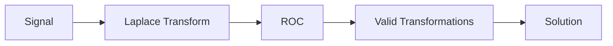

**Laplace Transform**
======================

### Introduction
-----------------

The Laplace transform is a powerful tool used to analyze signals and systems in the frequency domain. It converts a time-domain signal into a complex function of frequency, allowing us to study its properties and behavior.

### Core Concepts
-------------------

#### What is the Laplace Transform?
--------------------------------

The Laplace transform $X(s)$ of a continuous-time signal $x(t)$ is defined as:

$$X(s) = \int_{0^{-}}^{\infty} x(t)e^{-st}dt$$

where $s$ is a complex variable.

#### Region of Convergence (ROC)
-------------------------------

The ROC is the set of values for which the Laplace transform exists. It is determined by the behavior of the signal at infinity.

### Key Formulas/Theorems
---------------------------

* **Linearity**: The Laplace transform is linear, meaning that:
$$\mathcal{L}\{ax(t) + bu(t)\} = aX(s) + bU(s)$$
* **Time Shifting**:
$$\mathcal{L}\{x(t - T)u(t - T)\} = e^{-sT}X(s)$$
* **Frequency Shifting**:
$$\mathcal{L}\{e^{st}x(t)\} = X(s - s_0)$$

### Problem Solving Patterns
-----------------------------

When solving Laplace transform problems, follow these steps:

1. Identify the signal and its properties.
2. Determine the ROC based on the signal's behavior at infinity.
3. Apply the necessary transformations (e.g., linearity, time shifting).

### Examples with Solutions
---------------------------

**Example 1:**

Find the Laplace transform of $x(t) = t^2u(t)$.

```latex
\mathcal{L}\{t^2u(t)\} &= \int_{0^{-}}^{\infty} t^2e^{-st}dt \\
&= \left[-\frac{1}{s}t^2e^{-st} + \frac{2}{s^2}te^{-st} - \frac{2}{s^3}e^{-st}\right]_0^\infty \\
&= \frac{2}{s^3}
```

### Common Pitfalls
--------------------

* **Incorrect ROC**: Make sure to determine the ROC correctly, as it affects the validity of the Laplace transform.
* **Mistaken Transformations**: Double-check your transformations (e.g., linearity, time shifting) to ensure accuracy.

### Quick Summary
------------------

* The Laplace transform is a powerful tool for analyzing signals and systems in the frequency domain.
* Understand the ROC and its implications on the Laplace transform.
* Apply linearity, time shifting, and frequency shifting properties as needed.

**Mermaid Diagram:**


This comprehensive theory note covers the core concepts of Laplace transforms, including its definition, region of convergence (ROC), linearity, time shifting, and frequency shifting. The examples with solutions demonstrate how to apply these concepts to solve problems. By following this guide, students will be well-prepared to tackle similar questions on the GATE CS exam.