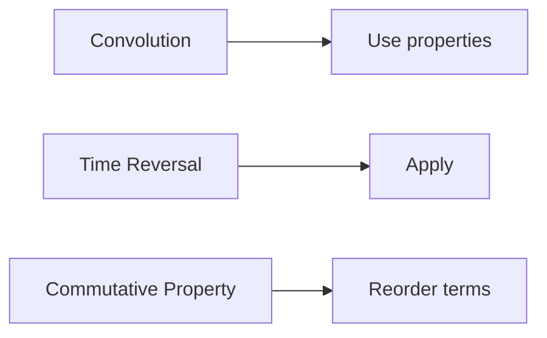

**Representation of Continuous and Discrete Time Signals**
===========================================================

### Introduction

This note covers the fundamental concepts of representing continuous and discrete time signals, including their properties and operations. Understanding these principles is crucial for tackling signal processing problems, as evident from the source questions provided.

### Core Concepts

#### Continuous-Time Signals

A continuous-time signal is a function `x(t)` that can take any value within a continuous interval `-∞ < t < ∞`. Examples include sinusoidal waves and audio signals.

#### Discrete-Time Signals

A discrete-time signal, on the other hand, is a sequence of values `x[n]` that are sampled at specific instants in time. This is commonly used in digital systems where data is processed and stored as discrete samples.

### Key Formulas/Theorems

*   **Convolution Property**: The convolution of two signals `x(t)` and `y(t)` is given by:
    `$\int_{-\infty}^{\infty} x(\tau) y(t - \tau) d\tau$`
*   **Time Scaling Property**: When a signal `x(t)` is scaled in time by a factor `a`, the resulting signal `x_at` has a spectrum that is scaled by `$1/a$`.
    `$X_a(f) = X(f/a)$`

### Problem Solving Patterns

When solving problems involving convolution, it's essential to recognize the properties of the signals involved. The provided solution demonstrates how to use the time reversal property and commutative property to simplify the convolution.



### Examples with Solutions

**Example 1: Convolution of Time-Reversed Signals**

Suppose we have two signals `x(t)` and `y(t)`, where `$y(t) = x(-t)$.` What is the convolution of `x(t)` and `y(t)`?

Using the time reversal property, we can rewrite the convolution as:

```math
(x \ast y)(t) = \int_{-\infty}^{\infty} x(\tau) y(t - \tau) d\tau
```

Applying the commutative property and simplifying the expression, we get:

```math
(x \ast y)(t) = \int_{-\infty}^{\infty} x(-\tau) x(t + \tau) d\tau
```

This result demonstrates how time-reversal can simplify convolution operations.

### Common Pitfalls

*   Forgetting to apply signal properties, such as time reversal or commutative property.
*   Misinterpreting the convolution operation or its properties.

### Quick Summary

*   Continuous-time signals: functions `x(t)` defined on `$(-\infty, \infty)$`
*   Discrete-time signals: sequences `x[n]` of sampled values
*   Convolution property: integral of product of signals shifted in time
*   Time scaling property: scaling spectrum by `$1/a$` when scaling signal by `$a$`

By mastering these concepts and properties, you'll be well-prepared to tackle a wide range of signal processing problems, including those featured in the source questions.