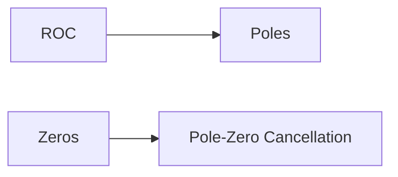

**z Transform**
================

### Introduction
-----------------

The z transform is a powerful tool for analyzing discrete-time signals and systems. It is a generalization of the Laplace transform, which is used to analyze continuous-time signals and systems. The z transform is widely used in signal processing, control systems, and communication systems.

### Core Concepts
------------------

#### Definition

The z transform of a discrete-time signal `x[n]` is defined as:

$$X(z) = \sum_{n=-\infty}^{\infty} x[n] z^{-n}$$

where $z$ is a complex variable, and $x[n]$ is the input signal.

#### Region of Convergence (ROC)

The ROC is the set of values of $z$ for which the z transform converges. The ROC can be either left-sided, right-sided, or two-sided.

#### Causal Signals

A causal signal is a signal that is zero for all negative time indices. The z transform of a causal signal `x[n]` is defined as:

$$X(z) = \sum_{n=0}^{\infty} x[n] z^{-n}$$

### Key Formulas/Theorems
---------------------------

#### Linearity Property

The linearity property states that the z transform of a linear combination of signals is equal to the sum of their individual z transforms:

$$\mathcal{Z}\left\{ \sum_{k=1}^{N} c_k x_k[n] \right\} = \sum_{k=1}^{N} c_k X_k(z)$$

where $c_k$ are constants, and $x_k[n]$ are signals.

#### Time-Shifting Property

The time-shifting property states that the z transform of a signal `x[n-k]` is equal to $z^k$ times the z transform of the original signal:

$$\mathcal{Z}\left\{ x[n-k] \right\} = z^k X(z)$$

#### Differentiation Property

The differentiation property states that the z transform of a signal `x'[n]` is equal to $z$ times the derivative of the z transform of the original signal:

$$\mathcal{Z}\left\{ x'[n] \right\} = z X'(z)$$

### Problem Solving Patterns
-----------------------------

#### Finding the ROC

To find the ROC, we need to determine for which values of $z$ the z transform converges. We can do this by analyzing the poles and zeros of the system.

#### Using the Linearity Property

We can use the linearity property to find the z transform of a linear combination of signals.

#### Using the Time-Shifting Property

We can use the time-shifting property to shift the time index of a signal.

### Examples with Solutions
---------------------------

**Example 1**

Find the z transform of the causal signal `x[n] = u[n]`.

Solution:

The z transform of a causal signal is defined as:

$$X(z) = \sum_{n=0}^{\infty} x[n] z^{-n}$$

Substituting `x[n] = u[n]`, we get:

$$X(z) = \sum_{n=0}^{\infty} u[n] z^{-n}$$

Using the linearity property, we can rewrite this as:

$$X(z) = \sum_{n=0}^{\infty} 1 z^{-n}$$

Simplifying, we get:

$$X(z) = \frac{z}{z-1}$$

**Example 2**

Find the z transform of the signal `x[n] = n u[n]`.

Solution:

Using the differentiation property, we can rewrite this as:

$$\mathcal{Z}\left\{ x'[n] \right\} = z X'(z)$$

Taking the derivative of $X(z)$, we get:

$$X'(z) = \frac{-1}{(z-1)^2}$$

Substituting this into the equation above, we get:

$$\mathcal{Z}\left\{ x'[n] \right\} = -\frac{z}{(z-1)^2}$$

Simplifying, we get:

$$X(z) = -\frac{z}{(z-1)^2} + \frac{1}{z-1}$$

### Common Pitfalls
--------------------

* Failing to check the ROC.
* Not using the correct property for the given problem.

### Quick Summary
-----------------

* The z transform is a powerful tool for analyzing discrete-time signals and systems.
* Key formulas include the linearity property, time-shifting property, and differentiation property.
* Common pitfalls include failing to check the ROC and not using the correct property for the given problem.