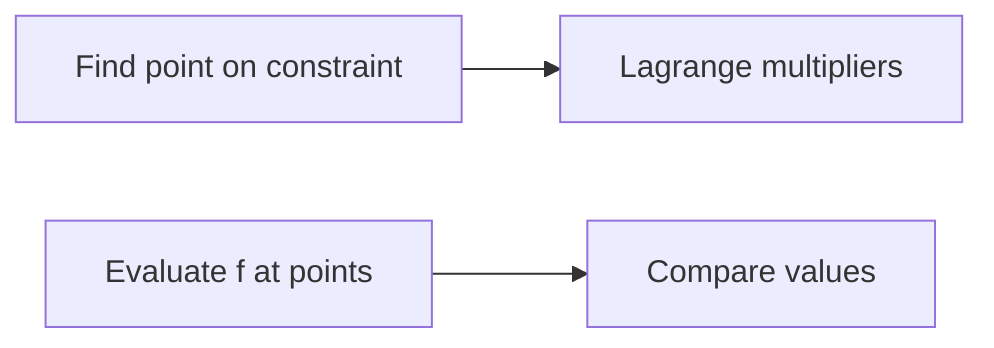

**Optimization using Calculus**
=====================================

**Introduction**
---------------

Optimization is a crucial concept in mathematics and computer science, with applications in various fields such as economics, engineering, and operations research. In this note, we will focus on optimization problems that can be solved using calculus.

**Core Concepts**
-----------------

### 1. Unconstrained Optimization

Unconstrained optimization involves finding the maximum or minimum value of a function without any constraints. We can use the following theorem:

**Theorem**: If $f(x)$ is a differentiable function, then it has a local maximum at $x=a$ if $\frac{df}{dx}(a) = 0$ and $\frac{d^2f}{dx^2}(a) < 0$. Similarly, it has a local minimum at $x=a$ if $\frac{df}{dx}(a) = 0$ and $\frac{d^2f}{dx^2}(a) > 0$.

### 2. Constrained Optimization

Constrained optimization involves finding the maximum or minimum value of a function subject to certain constraints. We can use the method of Lagrange multipliers:

**Theorem**: If $f(x,y)$ is a differentiable function and $g(x,y) = c$ is a constraint, then the maximum or minimum value of $f(x,y)$ occurs at a point $(x^*,y^*)$ where $\nabla f(x^*,y^*) = \lambda \nabla g(x^*,y^*)$.

**Key Formulas/Theorems**
-------------------------

*   **Gradient**: $\nabla f(x) = \left( \frac{\partial f}{\partial x}, \frac{\partial f}{\partial y} \right)$
*   **Laplacian**: $\Delta f(x,y) = \frac{\partial^2 f}{\partial x^2} + \frac{\partial^2 f}{\partial y^2}$
*   **Method of Lagrange multipliers**: $\nabla f(x^*,y^*) = \lambda \nabla g(x^*,y^*)$

**Problem Solving Patterns**
---------------------------

1.  Identify the objective function and constraints.
2.  Use the method of Lagrange multipliers or unconstrained optimization to find the maximum or minimum value.

### Example

Consider the function $f(x,y) = x^2 + y^2$ subject to the constraint $x+y=1$. We can use the method of Lagrange multipliers to find the maximum and minimum values:

**Solution**

1.  Find the point $(x,y)$ that lies on the line $y=1-x$.
2.  Use the Lagrange multiplier method: $\nabla f(x,y) = \lambda \nabla g(x,y)$
3.  Evaluate $f(x,y)$ at the points $(0,1)$ and $(1,0)$.

**Common Pitfalls**

*   Failing to identify the constraints or objective function.
*   Not using the correct method (e.g., Lagrange multipliers for constrained optimization).
*   Making computational errors when evaluating functions and derivatives.

**Quick Summary**
-----------------

*   Unconstrained optimization: find maximum or minimum of a function without constraints.
*   Constrained optimization: find maximum or minimum subject to constraints using Lagrange multipliers.
*   Key formulas: gradient, Laplacian, method of Lagrange multipliers.

Note that this is just a starting point and you can add more examples and visualizations as needed.