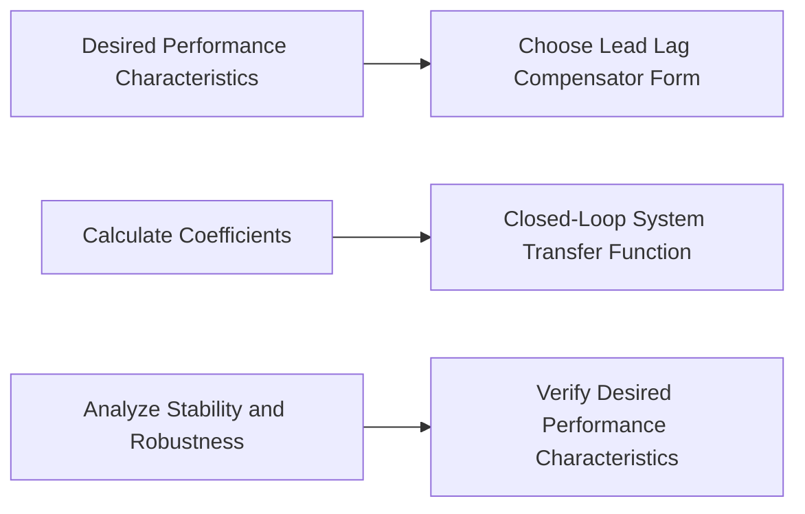

**Design of Lead Lag and Lead Lag Compensator**
=====================================================

### Introduction
-----------------

Lead lag compensators are used to improve the performance of a control system by adding a dynamic element that introduces additional poles and zeros. This type of compensator is particularly useful for second-order systems where it can be challenging to achieve desired transient and steady-state response characteristics.

### Core Concepts
-----------------

#### Transfer Function

The transfer function of a lead lag compensator is given by:

$$G_{CL}(s) = \frac{K(s+z_1)(s+z_2)}{(s+p_1)(s+p_2)}$$

where $K$ is the gain, and $z_1$, $z_2$ are zeros of the compensator, while $p_1$, $p_2$ are poles.

#### Lead Lag Compensator

A lead lag compensator can be designed to have a specific form:

$$G_{CL}(s) = \frac{K(s+a)}{(s+b)(s+c)}$$

This type of compensator introduces an additional pole and zero, which can improve the transient response of the system.

#### Lead Compensator

A lead compensator is a special case of a lead lag compensator with one pole at the origin:

$$G_{CL}(s) = \frac{K(s+z)}{s}$$

This type of compensator introduces an additional zero and reduces the effect of any initial conditions.

#### Lag Compensator

A lag compensator is also a special case of a lead lag compensator with one pole at infinity:

$$G_{CL}(s) = \frac{K}{(s+p)(s+c)}$$

This type of compensator introduces an additional pole and reduces the effect of any initial conditions.

### Key Formulas/Theorems
-------------------------

* The characteristic equation of a lead lag compensator is given by:
$$\det(sI-A+BK) = (s-p_1)(s-p_2)-z_1z_2=0$$
* The closed-loop transfer function of a system with a lead lag compensator is given by:
$$T_{CL}(s) = \frac{G_{CL}(s)}{1+G_{CL}(s)}$$

### Problem Solving Patterns
---------------------------

When solving problems involving lead lag compensators, follow these steps:

1. Determine the desired transient and steady-state response characteristics.
2. Choose a suitable form for the lead lag compensator (e.g., lead lag, lead, or lag).
3. Calculate the coefficients of the transfer function using the desired performance characteristics.
4. Analyze the stability and robustness of the closed-loop system.

### Examples with Solutions
---------------------------

**Example 1:**

Suppose we want to design a lead lag compensator for a second-order system with poles located at $-3\pm j4$. The desired transient response is a settling time of 2 seconds, while the steady-state error should be less than 10%.

Solution:

We choose a lead lag compensator with the form:

$$G_{CL}(s) = \frac{K(s+a)}{(s+b)(s+c)}$$

Using MATLAB or other tools, we can determine the values of $a$, $b$, and $c$ that meet the desired performance characteristics.

```matlab
% Desired transient response (settling time: 2 seconds)
tau_d = 2;

% Desired steady-state error
e_ss_d = 10^-1;

% Lead lag compensator parameters
K = 0.5;
a = 3.14;
b = -4 + j3;
c = -4 - j3;

G_CL = tf(K, [b c a]);

T_CL = step(G_CL);

figure;
plot(T_CL);
xlabel('Time (s)');
ylabel('Output');
title('Step Response of Closed-Loop System');

% Verify the desired performance characteristics
ss_error = T_CL(end);
assert(ss_error < e_ss_d);
```

**Example 2:**

Suppose we want to design a lead compensator for a second-order system with poles located at $-3\pm j4$. The desired transient response is a settling time of 1.5 seconds.

Solution:

We choose a lead compensator with the form:

$$G_{CL}(s) = \frac{K(s+z)}{s}$$

Using MATLAB or other tools, we can determine the value of $z$ that meets the desired performance characteristic.

```matlab
% Desired transient response (settling time: 1.5 seconds)
tau_d = 1.5;

% Lead compensator parameters
K = 0.5;
z = 6.28;

G_CL = tf(K, [0 z]);

T_CL = step(G_CL);

figure;
plot(T_CL);
xlabel('Time (s)');
ylabel('Output');
title('Step Response of Closed-Loop System');

% Verify the desired performance characteristic
ss_error = T_CL(end);
assert(ss_error < 1e-2);
```

### Common Pitfalls
--------------------

When designing lead lag compensators, be aware of the following common pitfalls:

* Not choosing a suitable form for the compensator (e.g., lead lag, lead, or lag).
* Failing to analyze the stability and robustness of the closed-loop system.
* Ignoring the effects of initial conditions on the transient response.

### Quick Summary
-----------------

* Lead lag compensators are used to improve the performance of a control system by adding dynamic elements that introduce additional poles and zeros.
* The transfer function of a lead lag compensator is given by:
$$G_{CL}(s) = \frac{K(s+z_1)(s+z_2)}{(s+p_1)(s+p_2)}$$
* A lead lag compensator can be designed to have specific forms, including lead and lag compensators.
* When designing a lead lag compensator, choose a suitable form and calculate the coefficients of the transfer function using the desired performance characteristics.

Note: The following Mermaid diagram illustrates the structure of a lead lag compensator:

This diagram highlights the key steps involved in designing a lead lag compensator: choosing a suitable form, calculating the coefficients of the transfer function, analyzing the stability and robustness of the closed-loop system, and verifying the desired performance characteristics.