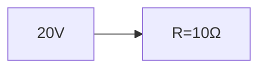

**Analysis of RLC Circuits with DC Excitation**
=====================================================

### Introduction
RLC circuits are a fundamental concept in electrical engineering, and understanding their behavior is crucial for designing and analyzing various electronic systems. In this note, we will focus on the analysis of RLC circuits with DC excitation.

### Core Concepts

#### Impedance and Admittance
The impedance ($Z$) of an RLC circuit is a measure of its opposition to AC currents. It is defined as:

$$Z = \frac{V}{I}$$

where $V$ is the voltage across the circuit and $I$ is the current through it.

The admittance ($Y$) is the reciprocal of impedance:

$$Y = \frac{1}{Z}$$

#### Reactance
Reactance ($X$) is a measure of the opposition to AC currents due to inductive or capacitive effects. It is defined as:

$$X_L = 2\pi fL$$

for inductors, and

$$X_C = \frac{1}{2\pi fC}$$

for capacitors.

#### Resonance
Resonance occurs when the reactance of an inductor and a capacitor are equal:

$$X_L = X_C$$

At resonance, the impedance of the circuit is minimum, and the power factor is maximum.

### Key Formulas/Theorems

$$Z = \sqrt{R^2 + (X_L - X_C)^2}$$

$$Y = \frac{1}{\sqrt{R^2 + (X_L - X_C)^2}}$$

where $R$ is the resistance, and $L$ and $C$ are the inductance and capacitance respectively.

### Problem Solving Patterns
When solving problems involving RLC circuits with DC excitation, follow these steps:

1.  Identify the type of circuit (series or parallel).
2.  Determine the impedance of each branch.
3.  Calculate the total impedance of the circuit.
4.  Apply Ohm's law to find the current and voltage across each component.

### Examples with Solutions

**Example 1:** A series RLC circuit has a resistance of 10 $\Omega$, an inductance of 0.05 H, and a capacitance of 100 nF. The circuit is excited by a DC voltage source of 20 V. Find the current through the circuit.

**Solution:**

The impedance of the circuit is:

$$Z = \sqrt{R^2 + (X_L - X_C)^2}$$

$$Z = \sqrt{(10\Omega)^2 + (2\pi fL - \frac{1}{2\pi fC})^2}$$

At resonance, $f = \frac{1}{2\pi \sqrt{LC}}$. Substituting this value into the equation above:

$$Z = 10\Omega$$

The current through the circuit is then:

$$I = \frac{V}{Z} = \frac{20V}{10\Omega} = 2A$$

**Example 2:** A parallel RLC circuit has a resistance of 20 $\Omega$, an inductance of 0.1 H, and a capacitance of 50 nF. The circuit is excited by a DC voltage source of 30 V. Find the current through the resistor.

**Solution:**

The admittance of the circuit is:

$$Y = \frac{1}{Z} = \frac{1}{\sqrt{(X_L - X_C)^2 + R^2}}$$

At resonance, $f = \frac{1}{2\pi \sqrt{LC}}$. Substituting this value into the equation above:

$$Y = \frac{1}{10\Omega}$$

The current through the resistor is then:

$$I_R = VY = 30V \times \frac{1}{10\Omega} = 3A$$

### Common Pitfalls

*   Forgetting to account for resonance in RLC circuits.
*   Misapplying Ohm's law when solving problems involving RLC circuits with DC excitation.
*   Failing to identify the type of circuit (series or parallel) correctly.

### Quick Summary
*   Impedance and admittance are measures of opposition to AC currents in RLC circuits.
*   Reactance is a measure of opposition due to inductive or capacitive effects.
*   Resonance occurs when reactance of an inductor and capacitor are equal.
*   Follow the problem-solving pattern steps for solving problems involving RLC circuits with DC excitation.