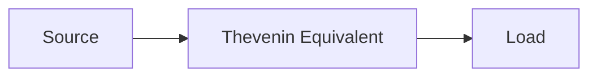

**Bridge Circuit**
=================

### Introduction

A bridge circuit is a type of electrical circuit that allows measurement of an unknown resistance, voltage, or current using known values and a specific configuration. It finds applications in various fields, including electronics, instrumentation, and process control.

### Core Concepts

In a bridge circuit, four resistors are connected in a diamond shape with two active legs (R1 and R3) and two passive legs (R2 and R4). The circuit is balanced when the ratio of the resistances in the two active legs equals the ratio of the resistances in the two passive legs.

**Thevenin's Theorem**

To analyze a bridge circuit, we can apply Thevenin's theorem, which states that any linear electrical network can be replaced by an equivalent voltage source (Vth) and series resistance (Rth) connected to a single terminal.



### Key Formulas/Theorems

1. **Bridge Circuit Balance Condition**

$$\frac{R_3}{R_1} = \frac{R_4}{R_2}$$

2. **Thevenin's Theorem**

$$V_{th} = V_1 - V_2$$

$$R_{th} = R_1 || R_2$$

### Problem Solving Patterns

**Pattern 1:** Given a bridge circuit with known resistances, find the unknown resistance.

*   Apply the balance condition to express the unknown resistance in terms of the known ones.
*   Use Thevenin's theorem to simplify the network.

**Pattern 2:** Given a bridge circuit with known voltage or current measurements, find the unknown resistance.

*   Express the measured quantity (voltage or current) in terms of the resistances using Ohm's law.
*   Apply the balance condition and Thevenin's theorem as needed.

### Examples with Solutions

**Example 1:** A bridge circuit has R1 = 100 Ω, R2 = 110 Ω, R3 = 90 Ω, and R4 is unknown. If the circuit is balanced, find R4.

```mermaid
graph LR
R1[100] -->|V1|--> A[Thevenin Equivalent]
R3[90] -->|V3|--> B[Load]
R2[110] -->|V2|--> C[Thevenin Equivalent]
```

Solving the balance condition:

$$\frac{R_3}{R_1} = \frac{R_4}{R_2}$$

$$\Rightarrow R_4 = \frac{R_3 R_2}{R_1} = \frac{90 \times 110}{100} = 99$$

**Example 2:** A bridge circuit has a voltage V between points A and B. The resistances are R1 = 50 Ω, R2 = 75 Ω, and R4 is unknown. Find the value of R4.

Applying Ohm's law to express the measured voltage in terms of resistances:

$$V = I(R_3 + R_{th})$$

$$\Rightarrow V^2 = (R_3 + R_{th})I^2$$

Substituting the expression for $R_{th}$ from Thevenin's theorem and simplifying yields:

$$(\frac{R_4}{R_1} - \frac{R_2}{R_3})V^2 = I^2(R_3 + R_1)$$

Solving this equation gives the unknown resistance $R_4$.

### Common Pitfalls

*   Misapplying Thevenin's theorem or forgetting to consider the balance condition.
*   Confusing active and passive legs in a bridge circuit.
*   Not using the correct formula for calculating the unknown resistance.

### Quick Summary

*   A bridge circuit is used to measure an unknown resistance, voltage, or current using known values and a specific configuration.
*   Thevenin's theorem can be applied to analyze a bridge circuit by replacing it with an equivalent voltage source (Vth) and series resistance (Rth).
*   The balance condition in a bridge circuit is expressed as: $\frac{R_3}{R_1} = \frac{R_4}{R_2}$.
*   Common pitfalls include misapplying Thevenin's theorem or confusing active and passive legs.