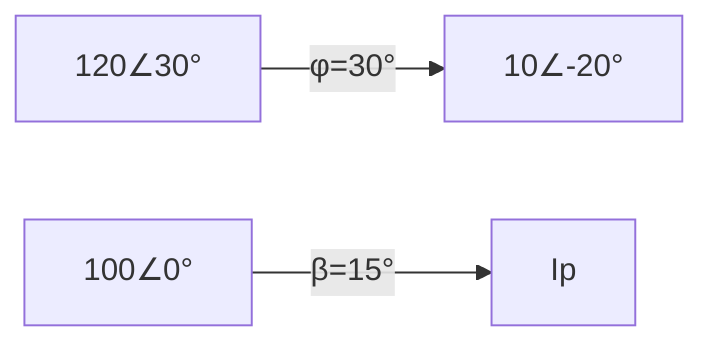

# Power Measurement
=====================

## Introduction

Power measurement is a crucial aspect of electrical circuits and machines. It involves measuring the rate at which electrical energy is transferred from a power source to a load. This topic is essential for understanding how electric devices function, as well as designing and optimizing electrical systems.

## Core Concepts

### Phasor Analysis

Phasor analysis is a powerful tool used in AC circuits to analyze voltages and currents that are out of phase with each other. A phasor is a complex number that represents the magnitude and angle of an AC quantity.

*   The **magnitude** of a phasor is its amplitude, or the maximum value it reaches.
*   The **angle** of a phasor is measured counterclockwise from the positive real axis to the point where the phasor intersects the unit circle.

Phasors are represented using the following notation:

$$\mathbf{A} = A \angle \theta = A(\cos \theta + j\sin \theta)$$

where $A$ is the magnitude and $\theta$ is the angle.

### Power Calculations

Power can be calculated using the formula:

$$P = VI \cos \phi$$

where $V$ is the voltage, $I$ is the current, and $\phi$ is the power factor (the cosine of the phase angle between voltage and current).

## Key Formulas/Theorems

*   **Wattmeter Formula**: The wattmeter measures the average power consumed by a circuit. The formula for calculating the power measured by a wattmeter is:

$$P = \frac{V_P I_P}{\cos^2 (\phi - \beta)}$$

where $V_P$ and $I_P$ are the pressure coil voltage and current, respectively, $\phi$ is the phase angle between voltage and current, and $\beta$ is the phase angle by which pressure coil current lags the pressure coil voltage.

*   **Power Factor**: The power factor is the ratio of real power to apparent power:

$$\text{pf} = \frac{\text{real power}}{\text{apparent power}}$$

## Problem Solving Patterns

### Understanding Phasor Diagrams

Phasor diagrams are used to represent the relationship between voltage and current in a circuit. To solve problems involving phasors, follow these steps:

1.  Identify the phasors involved: Determine which voltages and currents are represented by phasors.
2.  Draw the phasor diagram: Represent each phasor as an arrow on a complex plane, with the length of the arrow proportional to its magnitude and the angle from the positive real axis representing its phase.
3.  Analyze the relationships between phasors: Use the phasor diagram to determine which phasors are in phase (aligned) or out of phase.

### Calculating Power Measurements

When calculating power measurements, ensure you understand the wattmeter formula and apply it correctly:

1.  Identify the pressure coil voltage and current.
2.  Determine the phase angle between pressure coil voltage and current ($\phi$).
3.  Calculate the power measured by the wattmeter using the wattmeter formula.

## Examples with Solutions

### Example 1: Power Measured by a Wattmeter

Suppose we have a circuit with a voltage of $120 \angle 30^\circ$ V and a current of $10 \angle -20^\circ$ A. The pressure coil voltage is $100 \angle 0^\circ$ V, and the pressure coil current is lagging behind the pressure coil voltage by $\beta = 15^\circ$. Calculate the power measured by a wattmeter connected to this circuit.

Solution:

1.  Identify the phasors involved: Voltage ($V_P = 120 \angle 30^\circ$), current ($I_P = 10 \angle -20^\circ$), pressure coil voltage ($V_P = 100 \angle 0^\circ$).
2.  Draw the phasor diagram:

*   Analyze the relationships between phasors: Since $V_P$ and $I_P$ are in phase, $\phi = 0^\circ$. The pressure coil current lags behind the pressure coil voltage by $\beta = 15^\circ$, so we can calculate the power measured by the wattmeter using the wattmeter formula:

$$P = \frac{V_P I_P}{\cos^2 (\phi - \beta)} = \frac{(120 \angle 30^\circ)(10 \angle -20^\circ)}{\cos^2 (0^\circ - (-15^\circ))} = \frac{1200 \angle 10^\circ}{\cos^2 15^\circ}$$

Using a calculator, we get:

$$P ≈ 1231.36$$

### Example 2: Power Factor Calculation

A circuit has an apparent power of $1000$ VA and a real power of $800$ W. Calculate the power factor.

Solution:

The power factor is the ratio of real power to apparent power:

$$\text{pf} = \frac{\text{real power}}{\text{apparent power}} = \frac{800}{1000} = 0.8$$

## Common Pitfalls

### Misunderstanding Phasor Diagrams

*   Confusing the direction of phasors: Remember that a positive angle corresponds to a counterclockwise rotation from the positive real axis.
*   Failing to account for phase shifts:

Ensure you understand how phase shifts affect the relationships between phasors.

## Quick Summary

### Key Concepts

*   Phasor analysis
*   Power calculations (wattmeter formula, power factor)
*   Understanding phasor diagrams and analyzing their relationships

### Common Pitfalls

*   Misunderstanding phasor diagrams
*   Failing to account for phase shifts