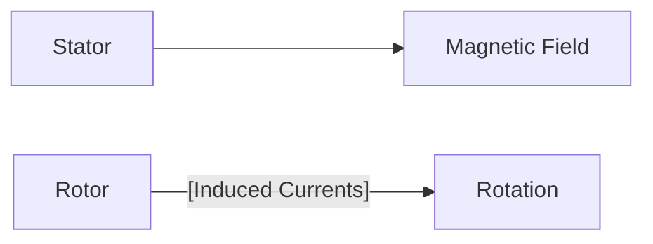

**Three Phase Induction Motor**
=====================================

**Introduction**
---------------

A three-phase induction motor is a type of AC electric motor that operates on the principle of electromagnetic induction. It is widely used in various industries due to its simplicity, reliability, and efficiency. In this note, we will cover the key concepts, formulas, and problem-solving patterns required to tackle questions related to three-phase induction motors.

**Core Concepts**
-----------------

### Principles of Induction Motor

*   The motor operates on the principle of electromagnetic induction, where a rotating magnetic field is created in the stator and induces currents in the rotor.
*   The rotor has no external power source; it gains energy from the stator through electromagnetic induction.

### Key Components

*   **Stator**: The stationary part of the motor that houses the windings and creates the rotating magnetic field.
*   **Rotor**: The rotating part of the motor that is induced to rotate by the magnetic field created in the stator.
*   **Slip**: The difference between the synchronous speed (rotor speed when there's no load) and the actual rotor speed.

### Motor Characteristics

*   **Starting Torque**: The minimum torque required to start the motor from rest.
*   **Maximum Torque**: The maximum torque that a motor can produce, usually occurring at a certain slip.

**Key Formulas/Theorems**
------------------------

*   **Slip (s) and Rotor Speed (N)**: $s = 1 - \frac{N}{N_s}$, where $N_s$ is the synchronous speed.
*   **Torque (T) in terms of Slip**: $T = k_i s$, where $k_i$ is a constant dependent on the motor design.

```math
s = 1 - \frac{N}{N_s}
```

**Problem Solving Patterns**
---------------------------

### Finding Maximum Torque and Corresponding Slip

*   Use the formula for torque in terms of slip: $T = k_i s$
*   Find the maximum torque by setting $\frac{dT}{ds} = 0$ and solving for $s$

### Example

Suppose a three-phase squirrel-cage induction motor has a starting torque of 100% of the full load torque and a maximum torque of 300% of the full load torque. We want to find the slip at the maximum torque.

1.  Let's denote the slip at the maximum torque as $s_{max}$.
2.  The maximum torque is given by $T_{max} = k_i s_{max}$, and since it's 300% of the full load torque, we have:
    $$\frac{T_{max}}{T_{full-load}} = \frac{k_i s_{max}}{k_i s_0}$$
3.  Using the fact that $\frac{T}{s} = \text{constant}$ (a property of induction motors), we can write:
    $$
    T_{max} = T_{full-load} + k_i s_0^2
    $$
4.  Substituting this into our expression for $\frac{T_{max}}{T_{full-load}}$, we get:
    $$\frac{k_i s_{max}}{k_i s_0} = \frac{s_0}{s_0 - s_{max}}
    $$
5.  Rearranging and solving for $s_{max}$, we find:
    $$
    s_{max} = \left(1 + \sqrt{\frac{T_{full-load}}{T_{max}}} \right) s_0
    $$

### Mermaid Diagram: Induction Motor Operation



**Common Pitfalls**
-------------------

*   Students often confuse the slip and rotor speed, leading to incorrect solutions.
*   Ignoring the effects of stator impedance can lead to inaccurate results.

**Quick Summary**
-----------------

| Key Concept | Formula/Description |
| --- | --- |
| Slip (s) | $s = 1 - \frac{N}{N_s}$ |
| Torque (T) in terms of Slip | $T = k_i s$ |
| Finding Maximum Torque and Corresponding Slip | Use $\frac{dT}{ds} = 0$ to find $s_{max}$ |

This comprehensive note covers the essential concepts, formulas, and problem-solving patterns required for three-phase induction motors. By mastering these topics, students can tackle questions related to this subject with confidence.