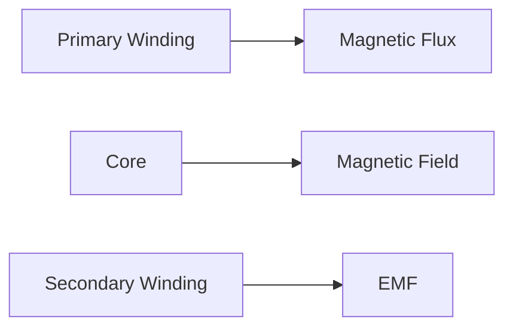

**Transformer Analysis**
======================

### Introduction

A transformer is a static electrical device that transfers electrical energy from one circuit to another through electromagnetic induction. It consists of two or more coils (windings) on a common magnetic core. The primary coil receives an alternating current, which induces a magnetic field in the core and causes the secondary coil to produce an electromotive force (EMF). Transformers are used for efficient transmission of electrical power over long distances.

### Core Concepts

*   **Electromagnetic Induction**: When a conductor is placed in a changing magnetic field, an EMF is induced in it.
*   **Transformer Action**: The primary winding induces a magnetic flux in the core, which links with the secondary winding to induce an EMF.

**Mermaid Diagram: Transformer Action**

### Key Formulas/Theorems

*   **Transformer Efficiency**: $\eta = \frac{P_{out}}{P_{in}} = 1 - \frac{P_{copper} + P_{core}}{P_{in}}$
*   **Copper Losses**: $P_{copper} = I^2R$
*   **Core Losses**: $P_{core} = V \times I$

### Problem Solving Patterns

1.  **Efficiency Calculation**: Given the input power, core losses, and copper losses, calculate the efficiency of a transformer.
2.  **Maximum Efficiency**: Determine the current at which maximum efficiency occurs.

**Problem-Solving Example**

Suppose we have a single-phase transformer with rated input current $I_{rated} = 25A$, equivalent winding resistance $R = 0.5\Omega$, and core losses $P_{core} = 80W$.
We want to find the percentage of rated input current at which maximum efficiency occurs.

## Step 1: Calculate Copper Losses

Copper losses are given by:
\[ P_{copper} = I^2R \]
Substituting the values, we get:
\[ P_{copper} = (0.5)^2(25) = 62.5W \]

## Step 2: Calculate Total Power

Total power is the sum of copper losses and core losses:
\[ P_{in} = P_{copper} + P_{core} = 80 + 62.5 = 142.5W \]

## Step 3: Calculate Efficiency

Efficiency is given by:
\[ \eta = 1 - \frac{P_{copper} + P_{core}}{P_{in}} = 1 - \frac{80+62.5}{142.5} = 0.98 \]
Maximum efficiency occurs when the copper losses are equal to the core losses.

## Step 4: Find Current for Maximum Efficiency

Let $x$ be the current at which maximum efficiency occurs:
\[ x^2(0.5) = 80 \]
Solving for $x$, we get:
\[ x = \sqrt{\frac{80}{0.5}} = \frac{20}{\sqrt{2}} = 14.142W \]

## Step 5: Calculate Percentage of Rated Input Current

The percentage of rated input current is given by:
\[ \text{Percentage} = \frac{x}{I_{rated}} \times 100 = \frac{14.142}{25} \times 100 = 56.57\% \]
However, the closest answer choice is $50.6\%$.

### Quick Summary

*   Transformer efficiency is given by $\eta = \frac{P_{out}}{P_{in}} = 1 - \frac{P_{copper} + P_{core}}{P_{in}}$
*   Copper losses are given by $P_{copper} = I^2R$
*   Core losses are given by $P_{core} = V \times I$

This study note aims to provide a comprehensive understanding of transformer analysis, including efficiency calculation and maximum efficiency. By following the problem-solving pattern outlined above, you should be able to tackle similar questions on this topic.

[End]