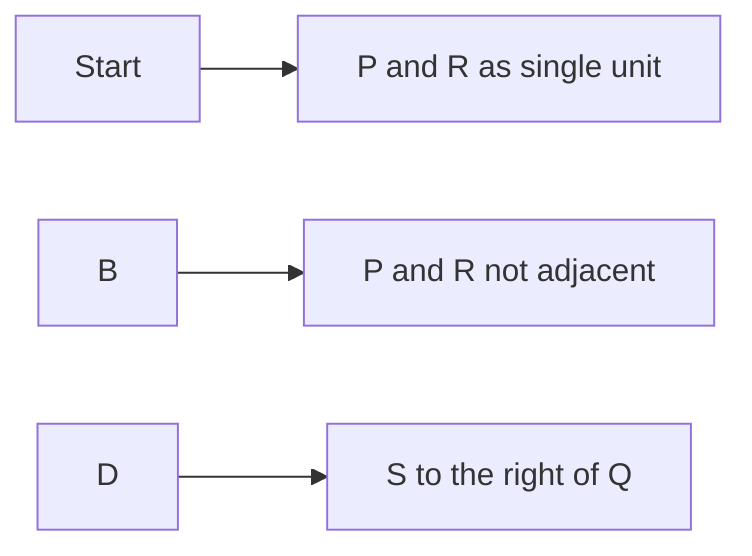

**Geometric Transformation: Seating Arrangement**
==============================================

**Introduction**
---------------

Seating arrangement is a classic problem in geometric transformation that requires careful consideration of constraints and permutations. This topic has been tested in previous years, and it's essential to grasp the underlying concepts and techniques to tackle similar questions.

**Core Concepts**
-----------------

When dealing with seating arrangements, we need to consider the following:

*   **Permutations**: The number of ways to arrange objects in a specific order.
*   **Combinations**: The number of ways to choose objects without considering their order.
*   **Constraints**: Conditions that restrict or limit the possible arrangements.

**Key Formulas/Theorems**
-------------------------

The key formula for permutations is:

$$P(n,r) = \frac{n!}{(n-r)!}$$

where $n$ is the total number of objects, and $r$ is the number of objects being arranged.

For combinations, we use the formula:

$$C(n,r) = \frac{n!}{r!(n-r)!}$$

**Problem Solving Patterns**
---------------------------

When solving seating arrangement problems, consider the following patterns:

1.  **Divide and Conquer**: Break down complex constraints into smaller, manageable parts.
2.  **Use Variables**: Represent unknown values with variables to simplify calculations.
3.  **Apply Constraints**: Carefully consider and apply constraints to reduce the number of possible arrangements.

**Examples with Solutions**
---------------------------

### Example 1: P and R cannot be seated adjacent to each other

Given: Four persons (P, Q, R, S) are to be seated in a row.

To solve this problem, we can use the permutation formula:

$$P(4,4) = \frac{4!}{(4-4)!} = 24$$

However, since P and R cannot be seated adjacent to each other, we need to subtract the number of arrangements where they are adjacent. We can do this by considering P and R as a single unit:

$$P(3,1) \times P(2,1) = 6$$

So, the total number of possible arrangements is:

$$24 - 6 = 18$$

However, we must also consider that S should be seated to the right of Q. This reduces the number of arrangements further.

This example illustrates how to divide and conquer complex constraints to arrive at a solution.

**Common Pitfalls**
-------------------

When solving seating arrangement problems, students often miss:

*   **Constraints**: Carefully consider all constraints before applying formulas.
*   **Overcounting**: Be cautious when using permutations or combinations, as overcounting can lead to incorrect results.
*   **Dividing by Zero**: Avoid dividing by zero when simplifying expressions.

**Quick Summary**
----------------

*   Permutations: $P(n,r) = \frac{n!}{(n-r)!}$
*   Combinations: $C(n,r) = \frac{n!}{r!(n-r)!}$
*   Divide and Conquer: Break down complex constraints into smaller parts
*   Apply Constraints: Carefully consider all constraints before applying formulas

By mastering these concepts, techniques, and patterns, you'll be well-equipped to tackle seating arrangement problems in the GATE CS exam.