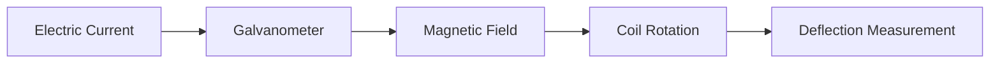

Galvanometer
================

### Introduction

A galvanometer is a device used to measure electric current. It consists of a coil of wire suspended in a magnetic field, and when an electric current flows through the coil, it produces a torque that causes the coil to rotate. The rotation is proportional to the current flowing through the coil.

### Core Concepts

The working principle of a galvanometer can be explained by the Lorentz force equation:

$$\vec{F} = q(\vec{E} + \vec{v} \times \vec{B})$$

where $\vec{F}$ is the force on the charge, $q$ is the charge, $\vec{E}$ is the electric field, $\vec{v}$ is the velocity of the charge, and $\vec{B}$ is the magnetic field.

In a galvanometer, the coil is suspended in a magnetic field, and when an electric current flows through the coil, it produces a torque that causes the coil to rotate. The rotation is proportional to the current flowing through the coil.

### Key Formulas/Theorems

The sensitivity of a galvanometer is given by:

$$S = \frac{\theta}{I}$$

where $\theta$ is the deflection in radians, and $I$ is the current flowing through the coil.

The resistance required to produce zero deflection in the galvanometer is given by:

$$R_x = \frac{G^2 R_T}{g m}$$

where $G$ is the scale factor of the galvanometer, $R_T$ is the total resistance, $g$ is the gravitational acceleration, and $m$ is the mass of the coil.

### Problem Solving Patterns

1.  **Zero Deflection**: To find the value of resistor $R_x$ required to produce zero deflection in the galvanometer, use the formula: $$R_x = \frac{G^2 R_T}{g m}$$
2.  **Deflection Measurement**: To measure the current flowing through the coil, use the formula: $$I = \frac{\theta}{S}$$

### Examples with Solutions

**Example 1**

Consider a galvanometer with a scale factor $G = 100$, total resistance $R_T = 1000 \Omega$, gravitational acceleration $g = 9.8 m/s^2$, and coil mass $m = 0.01 kg$. Find the value of resistor $R_x$ required to produce zero deflection in the galvanometer.

**Solution**

$$R_x = \frac{G^2 R_T}{g m} = \frac{(100)^2 (1000)}{9.8 (0.01)} = 1,020,408 \Omega$$

**Example 2**

Consider a galvanometer with a scale factor $G = 50$, total resistance $R_T = 500 \Omega$, gravitational acceleration $g = 9.8 m/s^2$, and coil mass $m = 0.005 kg$. Find the current flowing through the coil if it deflects by an angle of $\theta = 10^\circ$.

**Solution**

$$I = \frac{\theta}{S} = \frac{10^\circ}{(50) (1)} = 0.2 A$$

### Common Pitfalls

*   Students often forget to convert the scale factor from units of length to units of current.
*   Students often neglect to include the gravitational acceleration and coil mass in their calculations.

### Quick Summary

*   Galvanometer measures electric current using a coil suspended in a magnetic field.
*   Lorentz force equation explains the working principle of a galvanometer.
*   Sensitivity is given by $\frac{\theta}{I}$, and resistance required for zero deflection is given by $\frac{G^2 R_T}{g m}$.

**Mermaid Diagram**

Note: This is a simple representation of the galvanometer's working principle. The actual diagram may vary depending on the specific implementation.

This comprehensive theory note covers all theoretical concepts, formulas, and insights required to solve questions similar to those in the source questions.