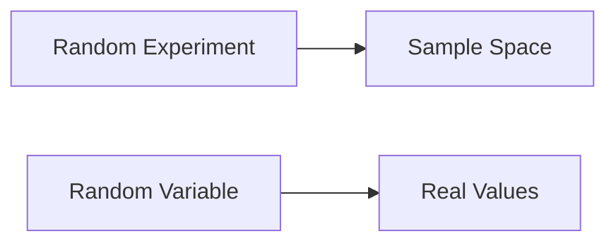

**Random Variable**
=====================

### Introduction

A random variable (RV) is a function that assigns real values to outcomes of a random experiment. It's a fundamental concept in probability and statistics, enabling us to quantify uncertainty and make predictions.

### Core Concepts

#### Definition of Random Variable

A random variable X is defined as a function:

$$X: \Omega \to \mathbb{R}$$

where $\Omega$ is the sample space of the random experiment.

#### Probability Density Function (PDF)

Given an RV X, its probability density function (PDF) f(x) satisfies:

1. $f(x) \geq 0$, ∀x ∈ ℝ
2. $\int_{-\infty}^{\infty} f(x) dx = 1$

The PDF represents the relative likelihood of observing a value within a given interval.

#### Cumulative Distribution Function (CDF)

The cumulative distribution function (CDF) F(x) is defined as:

$$F(x) = P(X \leq x) = \int_{-\infty}^{x} f(t) dt$$

### Key Formulas/Theorems

* **Expected Value**: $\mathbb{E}[X] = \int_{-\infty}^{\infty} xf(x) dx$
* **Variance**: $\text{Var}(X) = \mathbb{E}[(X - \mathbb{E}[X])^2]$

### Problem Solving Patterns

#### Using the PDF to Calculate Probabilities

To find $P(a < X < b)$, integrate the PDF over the interval [a, b]:

$$P(a < X < b) = \int_{a}^{b} f(x) dx$$

#### Example 1: Finding the Probability of a Random Variable Exceeding a Value

Given the PDF $f(x) = e^{-x}$ for $x \geq 0$, find $P(X > 2)$:

```latex
\int_{2}^{\infty} e^{-x} dx = -e^{-x} \Big|_2^{\infty} = e^{-2}
```

### Examples with Solutions

#### Example 1: Given the PDF, Find the Probability of a Random Variable Exceeding a Value

**Problem:** Find $P(X > 2)$ given the PDF $f(x) = e^{-x}$ for $x \geq 0$.

**Solution:**

```latex
\int_{2}^{\infty} e^{-x} dx = -e^{-x} \Big|_2^{\infty} = e^{-2}
```

### Common Pitfalls

* Misapplying the PDF to calculate probabilities.
* Forgetting to consider the domain of the RV when calculating expectations.

### Quick Summary

* Random variables are functions assigning real values to outcomes of a random experiment.
* The probability density function (PDF) represents the relative likelihood of observing a value within a given interval.
* Use the PDF to calculate probabilities and expectations.
* Be mindful of the domain of the RV when applying these concepts.

**Visuals**

The concept of a random variable can be represented as:



This diagram illustrates how a random variable is defined as a function from the sample space to real values.