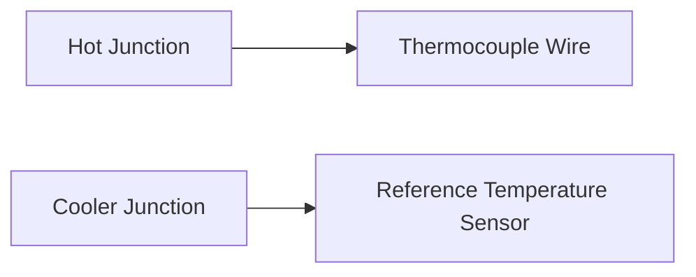

**Thermocouple Theory Note**
==========================

### Introduction
A thermocouple is a type of temperature sensor that measures temperature by converting it into an electrical voltage. It consists of two dissimilar metals joined at one end, creating a junction where the temperature difference generates a voltage.

### Core Concepts
#### Thermoelectric Effect
The thermoelectric effect states that when there's a temperature difference between the two metal junctions of a thermocouple, a small electric potential difference is generated. This phenomenon is known as Seebeck effect.

#### Thermocouple Output Voltage
The output voltage $V_{out}$ of a thermocouple can be expressed by the formula:

$$ V_{out} = S \cdot (T_j - T_r) $$

where:
- $S$ is the Seebeck coefficient,
- $T_j$ is the temperature at the hot junction, and
- $T_r$ is the reference temperature.

#### Reference Junction Compensation
In thermocouples with reference junction compensation, a separate thermocouple is used to measure the reference temperature. This ensures that the output voltage is directly proportional to the temperature difference between the two junctions.

### Key Formulas/Theorems

$$ V_{out} = S \cdot (T_j - T_r) $$

### Problem Solving Patterns
When solving problems related to thermocouples, follow these steps:

1.  Identify the type of thermocouple and its Seebeck coefficient.
2.  Determine the temperature difference between the hot junction and reference junction.
3.  Use the formula $V_{out} = S \cdot (T_j - T_r)$ to calculate the output voltage.

### Examples with Solutions

#### Example 1:
A J-type thermocouple has a Seebeck coefficient of 55 $\mu V/K$. If the temperature at the hot junction is 100°C and the reference temperature is 0°C, what is the output voltage?

Solution:

$$ V_{out} = S \cdot (T_j - T_r) $$
$$ V_{out} = 55 \mu V/K \cdot (100°C - 0°C) $$
$$ V_{out} = 5500 \mu V $$

#### Example 2:
Consider the instrumentation amplifier in question 46 of GATE 2021. The output voltage is given by:

$$ V_0 = G \cdot V_i $$

where:
- $G$ is the gain of the instrumentation amplifier, and
- $V_i$ is the input voltage.

Given that the gain $G$ is 20, and the input voltage $V_i$ is proportional to the temperature difference between the hot junction and reference junction, we can express it as:

$$ V_i = S \cdot (T_j - T_r) $$

Substituting this expression into the formula for output voltage, we get:

$$ V_0 = G \cdot S \cdot (T_j - T_r) $$

### Common Pitfalls
-   Students often forget to account for the reference temperature when calculating the output voltage.
-   Incorrect application of the Seebeck coefficient or its units.

### Quick Summary

*   Thermocouple measures temperature by converting it into an electrical voltage.
*   Output voltage is given by $V_{out} = S \cdot (T_j - T_r)$
*   Reference junction compensation ensures that output voltage is directly proportional to temperature difference.
*   Gain of instrumentation amplifier affects output voltage.

Please note that the following Mermaid diagram illustrates a simple thermocouple setup:

In this diagram, the hot junction is where the temperature to be measured is applied. The cooler junction is where the reference temperature is sensed.