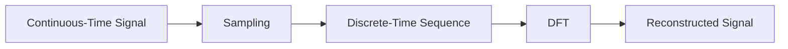

**Sequences and Discrete Time Signals**
=====================================

**Introduction**
---------------

Discrete time signals are a fundamental concept in signal processing, where a continuous-time signal is sampled at regular intervals to create a discrete-time sequence. This topic will cover the key concepts, formulas, and problem-solving strategies related to sequences and discrete time signals.

**Core Concepts**
-----------------

### Discrete Time Signals

A discrete time signal is a sequence of values that are sampled at regular intervals in time. It can be represented as:

$$x[n] = x_0, x_1, x_2, \ldots$$

where $n$ is the index of the sample.

### Sequences

A sequence is an ordered set of numbers that can be finite or infinite. In discrete time signal processing, sequences are used to represent signals in a more abstract way.

**Key Formulas/Theorems**
-------------------------

*   **Shannon's Sampling Theorem**: A continuous-time signal $x(t)$ can be perfectly reconstructed from its samples if the sampling rate is greater than twice the highest frequency component of the signal. Mathematically, this can be represented as:

$$\frac{1}{T_s} > 2B$$

where $T_s$ is the sampling period and $B$ is the bandwidth of the signal.
*   **Discrete Fourier Transform (DFT)**: The DFT of a sequence $x[n]$ is given by:

$$X[k] = \sum_{n=0}^{N-1} x[n] e^{-j2\pi kn/N}$$

where $k$ is the index of the frequency component.

**Problem Solving Patterns**
---------------------------

When solving problems related to sequences and discrete time signals, follow these steps:

1.  **Understand the problem statement**: Clearly identify what is being asked.
2.  **Identify the type of signal**: Determine whether it's a continuous-time or discrete-time signal.
3.  **Apply relevant formulas/theorems**: Use the appropriate equations to solve the problem.

**Examples with Solutions**
---------------------------

### Example 1: Sampling and Reconstruction

Consider a continuous-time signal $x(t) = \cos(2\pi t)$ sampled at $T_s = 0.5$ seconds. Determine if the sampling rate is sufficient to reconstruct the original signal using Shannon's Sampling Theorem.

**Solution**

The bandwidth of the signal is:

$$B = \frac{1}{2\pi} \cdot 2\pi = 1$$

Since $\frac{1}{T_s} > 2B$, the sampling rate is sufficient. However, in this case, we need to find the DFT of the sampled sequence.

### Example 2: Discrete Fourier Transform

Find the DFT of the sequence $x[n] = \delta[n - 5]$.

**Solution**

The DFT is given by:

$$X[k] = \sum_{n=0}^{N-1} x[n] e^{-j2\pi kn/N}$$

For this example, we can simplify the equation to:

$$X[k] = e^{-j10\pi k/N}$$

**Common Pitfalls**
-------------------

*   **Misunderstanding sampling and reconstruction**: Make sure to apply Shannon's Sampling Theorem correctly.
*   **Incorrect application of DFT formulas**: Double-check your calculations when using the DFT.

**Quick Summary**
---------------

*   Discrete time signals are represented as sequences of values sampled at regular intervals in time.
*   Sequences can be finite or infinite.
*   Use Shannon's Sampling Theorem to determine if a continuous-time signal can be reconstructed from its samples.
*   Apply the DFT formulas to analyze and synthesize discrete-time signals.

This comprehensive theory note covers all the key concepts, formulas, and problem-solving strategies related to sequences and discrete time signals. By following this guide, you'll be well-prepared to tackle similar questions in the future.