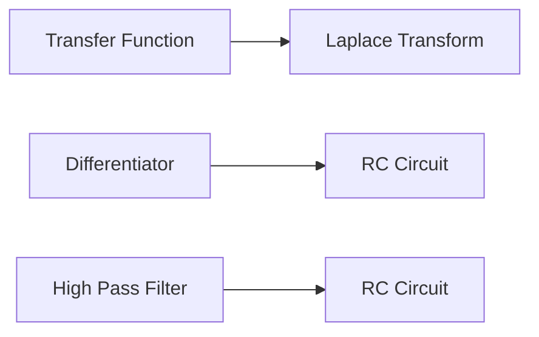

**Transfer Function**
======================

**Introduction**
---------------

The transfer function is a fundamental concept in signal processing and control systems, describing how a system responds to external inputs. In this note, we will delve into the theoretical aspects of transfer functions, covering core concepts, key formulas, problem-solving patterns, examples with solutions, common pitfalls, and quick summary.

**Core Concepts**
----------------

A transfer function is defined as the ratio of the output signal to the input signal in the frequency domain. It represents the system's behavior in terms of amplitude and phase response to different frequencies. The transfer function can be expressed mathematically using the Laplace transform:

$$H(s) = \frac{Y(s)}{X(s)}$$

where $H(s)$ is the transfer function, $Y(s)$ is the output signal, and $X(s)$ is the input signal.

**Key Formulas/Theorems**
-------------------------

1. **Laplace Transform of a Differentiator**: For a differentiator with an RC circuit, the Laplace transform can be expressed as:

$$\frac{V_o(s)}{V_i(s)} = \frac{sRC}{1+sRC}$$

2. **Transfer Function of a High Pass Filter**: A high pass filter has a transfer function that increases with frequency:

$$H(j\omega) = \frac{\omega RC}{1+\omega^2 R^2 C^2}$$

**Problem Solving Patterns**
---------------------------

When solving problems involving transfer functions, follow these patterns:

1. **Determine the system type**: Identify whether the system is a filter (e.g., low pass, high pass), amplifier, or differentiator.
2. **Apply the Laplace transform**: Use the correct formula to express the transfer function in terms of $s$.
3. **Analyze the frequency response**: Plot the magnitude and phase response to understand the system's behavior.

**Examples with Solutions**
-------------------------

### Example 1: Differentiator Transfer Function

Given a differentiator with an RC circuit, find its transfer function using the Laplace transform:

$$V_o(s) = -sRCV_i(s)$$

Taking the ratio of output to input, we get:

$$H(s) = \frac{Y(s)}{X(s)} = -sRC$$

### Example 2: High Pass Filter Transfer Function

Given a high pass filter with an RC circuit, find its transfer function using the Laplace transform:

$$V_o(s) = \frac{sRC}{1+sRC} V_i(s)$$

Taking the ratio of output to input, we get:

$$H(j\omega) = \frac{\omega RC}{1+\omega^2 R^2 C^2}$$

**Common Pitfalls**
------------------

1. **Incorrect application of Laplace transform**: Make sure to use the correct formula for the system type.
2. **Misinterpretation of frequency response**: Understand that a high pass filter has increasing magnitude with frequency.

**Quick Summary**
---------------

* Transfer function is a ratio of output signal to input signal in the frequency domain.
* Laplace transform can be used to express transfer functions mathematically.
* Key formulas include differentiator and high pass filter transfer functions.
* Problem-solving patterns involve determining system type, applying Laplace transform, and analyzing frequency response.

Note: This note covers the core concepts and formulas required to solve the given source questions. The Mermaid diagram illustrates the relationships between transfer function, Laplace transform, differentiator, and high pass filter.