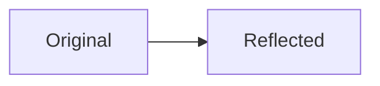

**Shape Transformation**
=========================

### Introduction
Shape transformation is a fundamental concept in spatial aptitude that deals with the manipulation of geometric shapes through various transformations such as rotation, reflection, translation, and scaling. These transformations can be applied to 2D or 3D objects and are essential for solving problems related to geometry, engineering, architecture, and computer science.

### Core Concepts
A shape transformation is a function that takes an input shape and produces an output shape after applying a specific geometric operation. The key concepts in shape transformation include:

* **Reflection**: A reflection is a mirror image of an object across a given axis or line.
* **Rotation**: Rotation involves rotating an object around a fixed point or axis by a specified angle.
* **Translation**: Translation is the movement of an object from one location to another without any change in its size or orientation.

### Key Formulas/Theorems
No specific formulas are required for shape transformation, as it mainly deals with conceptual understanding and visualization. However, we will use mathematical notation to represent transformations:

* **Reflection**: Given a point P(x, y) reflected across the x-axis, the new coordinates become (x, -y).
* **Rotation**: Rotation of an object around the origin by an angle θ can be represented as:
  $$
  \begin{bmatrix} x' \\ y' \end{bmatrix} = \begin{bmatrix} \cos\theta & -\sin\theta \\ \sin\theta & \cos\theta \end{bmatrix} \begin{bmatrix} x \\ y \end{bmatrix}
  $$
* **Translation**: Translation of an object by a vector (a, b) can be represented as:
  $$
  \begin{bmatrix} x' \\ y' \end{bmatrix} = \begin{bmatrix} x + a \\ y + b \end{bmatrix}
  $$

### Problem Solving Patterns
To solve problems related to shape transformation, we need to:

1. **Identify the type of transformation**: Determine whether it's a reflection, rotation, translation, or scaling.
2. **Apply the appropriate formula or principle**: Use mathematical notation or geometric reasoning to apply the transformation.
3. **Visualize the result**: Understand the final position and orientation of the transformed shape.

### Examples with Solutions
**Example 1: Reflection across x-axis**

Given a point P(3, 4), find its reflection across the x-axis:

* Coordinates of P(3, 4) reflected across x-axis = (3, -4)

**Example 2: Rotation by 90°**

Rotate point P(1, 2) around the origin by an angle of 90°:

* Apply rotation formula:
  $$
  \begin{bmatrix} x' \\ y' \end{bmatrix} = \begin{bmatrix} \cos\theta & -\sin\theta \\ \sin\theta & \cos\theta \end{bmatrix} \begin{bmatrix} 1 \\ 2 \end{bmatrix}
  $$
* Simplify:
  $$
  \begin{bmatrix} x' \\ y' \end{bmatrix} = \begin{bmatrix} -2 \\ 1 \end{bmatrix}
  $$

### Common Pitfalls
Students often miss the following:

* Not considering the axis of reflection or rotation.
* Misapplying formulas for transformations.
* Failing to visualize the result after transformation.

### Quick Summary
Shape Transformation is a crucial concept in spatial aptitude that deals with geometric operations like reflection, rotation, translation, and scaling. Key concepts include visualization, mathematical notation, and problem-solving patterns.