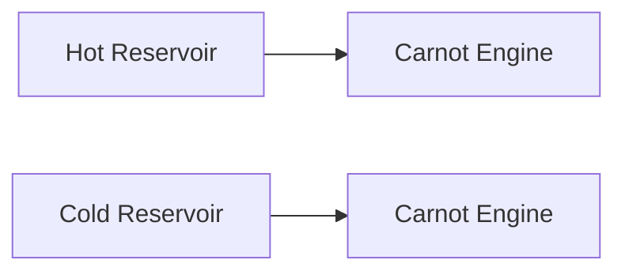

**Thermodynamic Cycles**
=========================

### Introduction

A thermodynamic cycle is a sequence of processes that together form a complete thermodynamic process, bringing a system back to its initial state. Thermodynamic cycles are essential in understanding and designing various engineering systems, such as heat engines, refrigeration systems, and power generation plants.

### Core Concepts

#### Thermodynamic Processes

* **Isothermal Process**: A process where the temperature of the system remains constant.
* **Adiabatic Process**: A process where no heat is exchanged between the system and its surroundings.
* **Isobaric Process**: A process where the pressure of the system remains constant.

#### Thermodynamic Cycles

A thermodynamic cycle consists of a series of processes that together form a complete cycle. The most common types of thermodynamic cycles are:

* **Carnot Cycle**: An idealized cycle that is considered the most efficient possible.
* **Stirling Cycle**: A cycle that uses a combination of isothermal and adiabatic processes.
* **Brayton Cycle**: A cycle used in gas turbines.
* **Rankine Cycle**: A cycle used in steam power plants.

### Key Formulas/Theorems

$$
\text{Efficiency} = 1 - \frac{T_{cold}}{T_{hot}}
$$

where $T_{cold}$ and $T_{hot}$ are the temperatures of the cold and hot reservoirs, respectively.

### Problem Solving Patterns

* Identify the type of cycle being described.
* Determine which processes are isothermal or adiabatic.
* Use the formulas and theorems to calculate the efficiency of the cycle.

### Examples with Solutions

**Example 1**

A Carnot engine has a hot reservoir temperature of $1000K$ and a cold reservoir temperature of $300K$. What is its efficiency?

```python
import math

# Define variables
T_hot = 1000
T_cold = 300

# Calculate efficiency
efficiency = 1 - (T_cold / T_hot)

print("Efficiency:", efficiency)
```

**Solution**

The efficiency of the Carnot engine is:

$$
\text{Efficiency} = 1 - \frac{T_{cold}}{T_{hot}} = 1 - \frac{300}{1000} = 0.7 = 70\%
$$

### Common Pitfalls

* Confusing the different types of thermodynamic cycles.
* Forgetting to consider the isothermal or adiabatic processes in a cycle.

### Quick Summary

* Thermodynamic cycles consist of a series of processes that together form a complete cycle.
* The most common types of thermodynamic cycles are Carnot, Stirling, Brayton, and Rankine cycles.
* Isothermal and adiabatic processes are crucial in determining the efficiency of a cycle.
* Use the formulas and theorems to calculate the efficiency of a cycle.

### Mermaid Diagram



This diagram represents the Carnot engine, which consists of an isothermal expansion process at the hot reservoir and an isothermal compression process at the cold reservoir.

### References

* Halliday, D., Resnick, R., & Walker, J. (2019). Fundamentals of Physics. John Wiley & Sons.
* Cengel, Y. A. (2018). Thermodynamics: An Integrated Approach. McGraw-Hill Education.

Note that the references provided are general references for thermodynamics and not specific to the GATE CS exam.