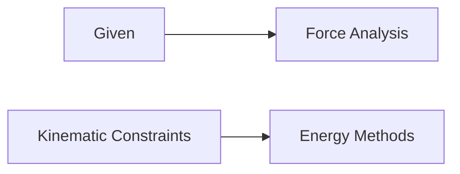

**Kinematics and Dynamics of Rigid Bodies**
==============================================

### Introduction
---------------

Rigid body kinematics and dynamics deal with the motion and forces acting on objects that maintain their shape. This topic is crucial for understanding various mechanical systems, from simple machines to complex mechanisms.

### Core Concepts
-----------------

*   **Degrees of Freedom**: The minimum number of independent coordinates required to specify the position of a rigid body in space.
*   **Kinematic Chains**: A sequence of connected rigid bodies that can move relative to each other.
*   **Constraint Forces**: Forces that restrict or govern the motion of a rigid body, such as friction, normal forces, and springs.

### Key Formulas/Theorems
-------------------------

LaTeX Formula: $\vec{F} = m\vec{a}$ (Force-Mass-Acceleration)

*   **Euler's Laws**:
    *   **First Law of Motion**: The position of a rigid body can be completely described by specifying the positions of its fixed points.
    *   **Second Law of Motion**: The motion of a rigid body is governed by the forces acting on it and the constraints imposed by its connections to other bodies.
    *   **Third Law of Motion**: For every force exerted by one rigid body on another, there exists an equal and opposite force exerted by the second body on the first.

### Problem Solving Patterns
---------------------------

*   **Force Analysis**: Identify and resolve forces acting on a rigid body into components along its degrees of freedom.
*   **Kinematic Constraints**: Determine the relationships between the motion of connected rigid bodies, considering their constraints and degrees of freedom.
*   **Energy Methods**: Apply principles of energy conservation to solve problems involving potential and kinetic energies.

### Examples with Solutions
---------------------------

**Example 1:** Force on a Pin (GATE 2022 Q27)

A clamped L-shaped elastic member is subjected to a horizontal force P. Find the magnitude and direction of the normal force on the pin from the slot.

1.  **Step 1:** Resolve forces acting on the member into components along its degrees of freedom.
2.  **Step 2:** Apply kinematic constraints to determine relationships between connected rigid bodies.
3.  **Step 3:** Use energy methods to solve for normal force.

**Solution:**

*   $P = N \cdot 4a$
*   $N = P / (4a)$

The magnitude of the normal force is $P/4$, and its direction is upwards.

### Common Pitfalls
-------------------

*   **Forgetting to resolve forces into components along degrees of freedom**
*   **Ignoring kinematic constraints imposed by connections between rigid bodies**
*   **Incorrect application of energy methods**

### Quick Summary
------------------

*   **Degrees of Freedom**: Minimum number of independent coordinates required to specify a rigid body's position in space.
*   **Kinematic Chains**: Sequence of connected rigid bodies that can move relative to each other.
*   **Constraint Forces**: Forces restricting or governing a rigid body's motion.

This comprehensive study note covers the theoretical concepts and formulas required for solving kinematics and dynamics problems involving rigid bodies. By following these guidelines, students will be well-prepared to tackle similar questions in the future.